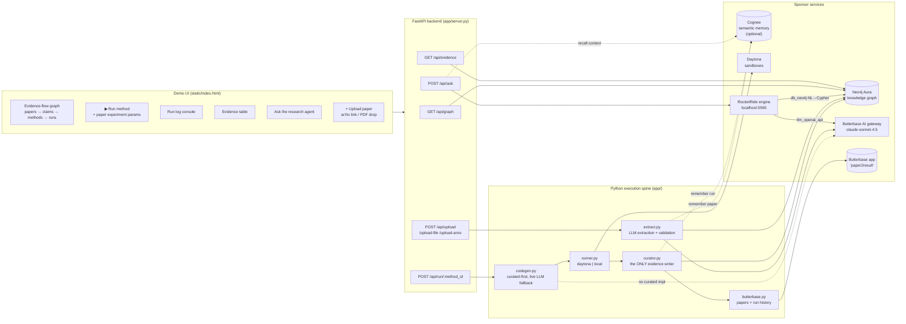
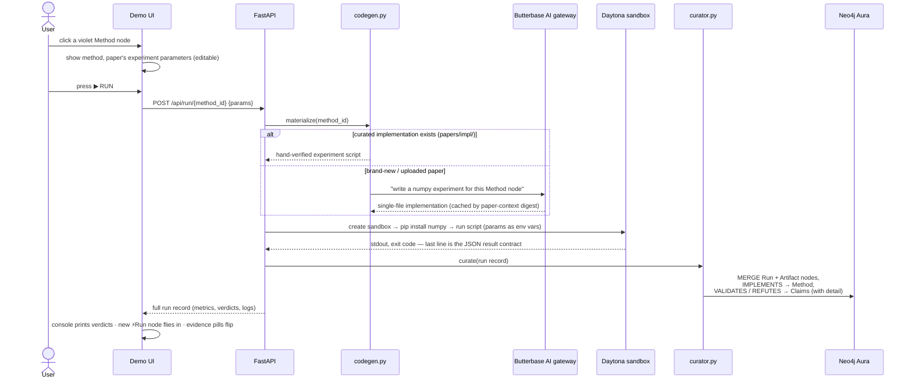
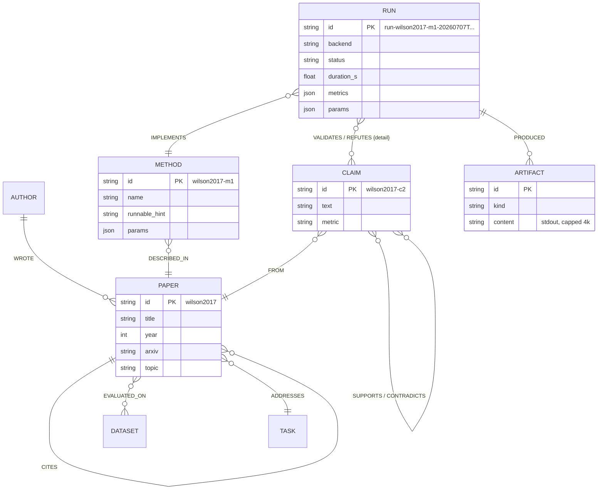
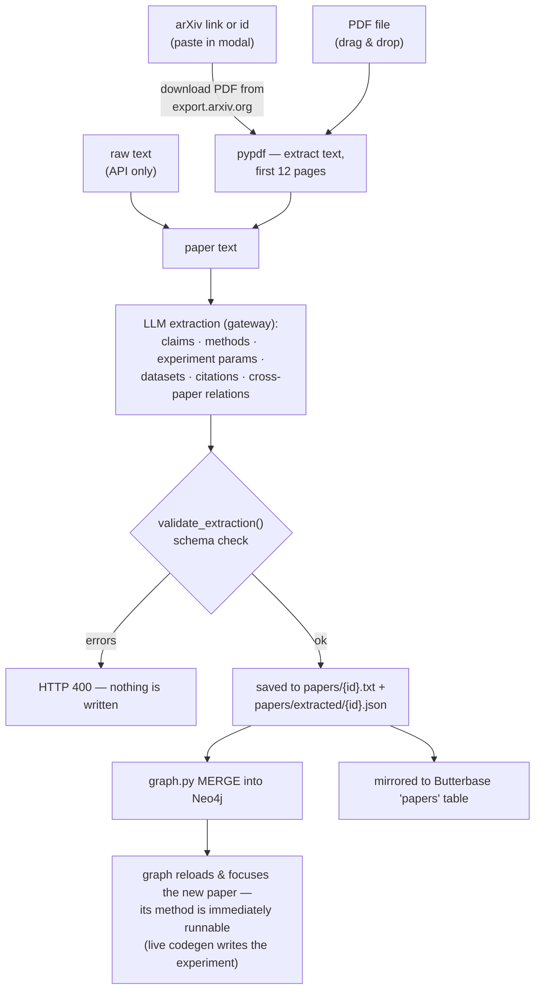
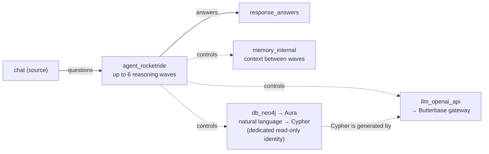
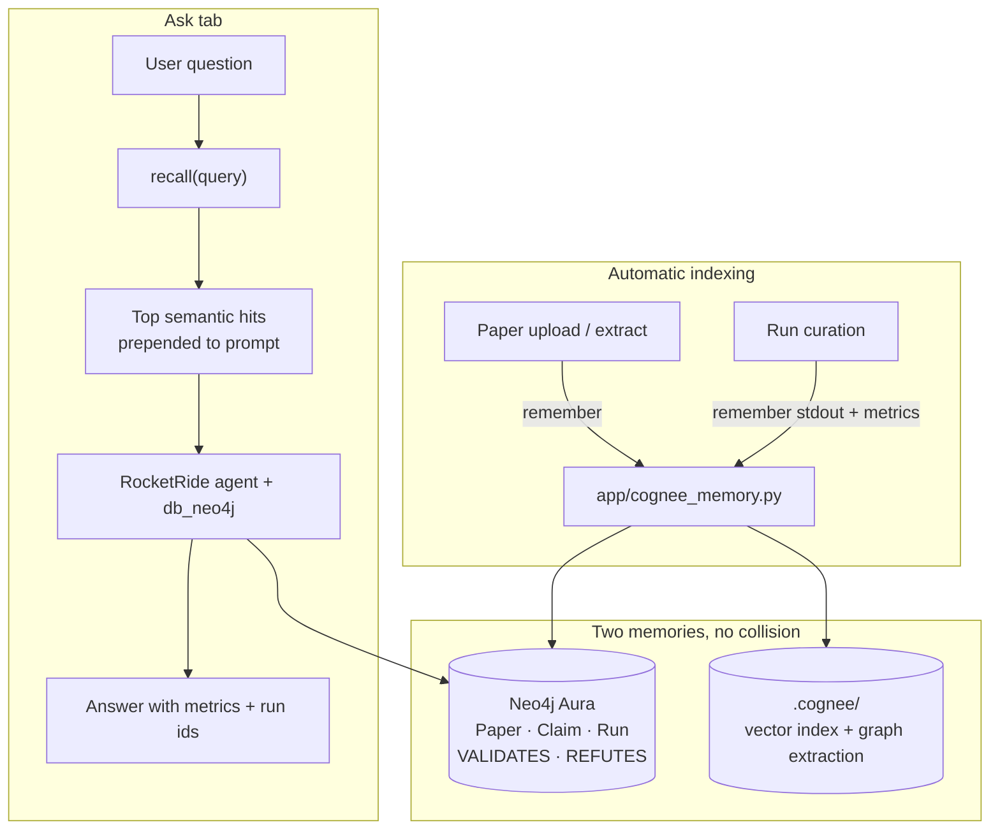

# Paper→Results Graph

**Turn research papers into executable evidence.**

🔴 **Live evidence explorer: [paper2result.butterbase.dev](https://paper2result.butterbase.dev/)** — the real research graph (papers, claims, conflicts, runs, and verdicts) served from Butterbase.

Built for **HackwithBay 3.0** (July 7, 2026, AWS Builder Loft SF) — theme: *Thoughtful Agents for Productivity*.

---

## 1. What is this?

When researchers read papers, they end up with **claims** — sentences like *"Adam converges faster than SGD"* or *"adaptive optimizers generalize worse."* Different papers routinely **contradict each other**, and the only way to know who is right is to actually **run the experiment**. Almost nobody does, because reimplementing a paper's method takes hours or days.

Paper→Results Graph automates that entire loop:

> **Paper → Claim → Method → Code → Sandbox Run → Result → Graph Update**

In plain words, the system:

1. **Reads papers** (paste an arXiv link or drop a PDF) and extracts their claims, methods, and experiment parameters into a **knowledge graph**.
2. **Shows you where papers disagree** — dashed amber `CONTRADICTS` edges between claims from different papers.
3. Lets you click any method and press **▶ RUN** — it **writes the experiment code itself** (or uses a hand-verified implementation), executes it in an **isolated cloud sandbox**, and measures the results.
4. **Writes the outcome back into the graph** as a `Run` node with a verdict edge: **`VALIDATES`** (the measurement supports the claim) or **`REFUTES`** (it doesn't) — with the exact metrics attached.
5. Lets you **ask an AI agent questions** like *"which claims have executable evidence?"* — and the agent answers by querying the live graph, citing real run ids and exact numbers.

The one-sentence pitch: **most tools help you read papers — this one helps you test them.**

### Why this beats "Paper2Code"

Paper2Code-style tools stop at generating code. Here the code **actually runs**, and the outcome — success, failure, error message, measured metric — becomes a permanent, queryable part of the knowledge graph. Even a **failed run is evidence**: the error and logs are stored so the next researcher knows what broke.

> Research should not end at reading. It should end in evidence.

---

## 2. Glossary (read this first)

| Term | Meaning here |
|---|---|
| **Paper** | A research publication, stored with title/year/arXiv id. Seed corpus: Adam (2014), Wilson et al. (2017), AdamW (2017) — three optimizer papers that genuinely disagree. |
| **Claim** | One falsifiable statement a paper makes, e.g. `wilson2017-c2`: *"On a constructed separable problem, SGD achieves zero test error while Adam approaches 50%."* |
| **Method** | A procedure from a paper that can be reproduced as a small experiment, e.g. `wilson2017-m1`: the linearly-separable counterexample construction. |
| **Experiment parameters** | The knobs the paper's experiment uses (training set size, steps, learning rates, class imbalance…). Stored on the Method node; editable in the UI before each run. |
| **Run** | One execution of a method: which backend ran it, how long it took, the measured metrics, and a verdict per claim. |
| **VALIDATES / REFUTES** | Edges from a Run to Claims. The verdict is **computed from the measured metrics against explicit thresholds** inside the experiment script — never hardcoded. |
| **Evidence** | The set of Runs attached to a claim. A claim with no runs shows as *"no runs yet"*. |
| **Sandbox** | An isolated cloud machine (Daytona) where generated code executes safely — it can't touch your laptop. |

---

## 3. System architecture — the big picture



**How to read this diagram, left to right:**

- **The UI** is a single HTML page with three columns: controls on the left (selected method, parameters, run log), the **graph** in the center, and evidence + agent chat on the right.
- **FastAPI** is a thin HTTP layer. It never contains business logic — it dispatches to the spine.
- **The Python execution spine** is where the real work happens. The most important rule of the whole codebase: **only `curator.py` and `graph.py` ever write to Neo4j.** The AI agents can *read* the graph, but evidence is written exclusively by deterministic Python after a real execution. That's what makes the evidence trustworthy.
- **The sponsor services**: Neo4j stores the graph; Daytona runs the code; the Butterbase AI gateway serves **every single LLM call in the project** (extraction, code generation, the agent) through one OpenAI-compatible endpoint — there is no OpenAI key anywhere; the Butterbase app also archives papers and run history; the local RocketRide engine hosts the reasoning agent. **Cognee** (optional) adds a second memory layer for natural-language recall over paper prose and run logs — see §8.

---

## 4. The closed loop — what happens when you press ▶ RUN

This is the heart of the product. Step by step:



**Plain-language walkthrough:**

1. **You click a method** — say *"Linearly separable counterexample"* from Wilson et al. The left panel fills with the method description and the **paper's own experiment parameters** (`n_train=200`, `steps=4000`, `p_pos=0.6`, learning rates…). You can edit any of them — edited fields highlight amber.
2. **Code is materialized.** If we have a hand-verified implementation (the Wilson demo method does), it's used. If the method has no reviewed implementation, **the LLM writes one on the spot** from the Method node's description — numpy-only, no network, must finish in under a minute. Generated code is cached under a digest of the complete active paper/method context, so a same-ID paper revision cannot reuse stale code. Older `papers/impl` files explicitly marked LLM-generated are retained for audit but never assigned the current context digest or trusted as curated code.
3. **The code runs in a Daytona sandbox** — a real, isolated cloud machine created fresh for this run (visible in your Daytona dashboard, named after the run). Parameter overrides are validated and travel in as constrained `P2R_*` variables. LLM-generated implementations are sandbox-only: missing credentials or sandbox failure produces a recorded failure and never falls back to the host. Checked-in curated implementations may run locally with a scrubbed environment.
4. **The script reports results under a strict contract**: its final stdout line must be one JSON object — `{method_id, params, metrics, claim_checks:[{claim_id, verdict, detail}]}`. Crucially, each verdict is **computed inside the script** by comparing measured metrics to explicit thresholds. The system cannot wish a claim true.
5. **The curator writes evidence into the graph** — a `Run` node with metrics, params, the exact implementation SHA-256, and its paper-context digest; an `Artifact` node with the captured log; `IMPLEMENTS` to the method; and `VALIDATES`/`REFUTES` edges (each carrying a human-readable `detail`) to the claims. A **failed run is curated too** — status, error, and logs become evidence. Historical runs missing either digest remain explicitly provisional.
6. **The UI reacts**: the console streams the staged log (`① generating… ② dispatching… ④ VALIDATES wilson2017-c2 — GD test error 0.000 vs Adam 0.425 ⑤ graph updated ✓`), the camera flies to the new glowing Run node, and the evidence table's dashed *"no runs yet"* pills flip to green **VALIDATES** / red **REFUTES** pills.

**Total wall time: ~5–10 seconds** with Daytona, ~2 seconds locally.

---

## 5. The knowledge graph — what's stored and how it's connected



**How to read it:** the left half (Paper/Author/Claim/Method/Dataset) is what papers *say*. The right half (Run/Artifact) is what we *did about it*. The two meet at the verdict edges — `VALIDATES` / `REFUTES` — which is the entire point of the product.

Two practical notes:

- **Ids are stable, human-readable slugs** (`adam2014`, `wilson2017-c2`, `run-wilson2017-m1-20260707T204339Z`), so the agent can cite them and you can grep for them.
- The Aura instance is **shared with another project**, so every reset/delete in this codebase is scoped to our node labels (`OUR_LABELS` in `app/db.py`). We never run label-less deletes.

Useful canned queries live in `app/queries.py`: all claims per paper, all cross-paper conflicts, all runnable methods, and the demo's money query — *which claims have executable evidence?*

---

## 6. Uploading a new paper — from arXiv link to runnable method in ~30 seconds



**What makes this smart:** the extraction prompt includes a summary of the papers already in the graph, so a new paper arrives **pre-linked** — when we uploaded Lookahead (Zhang 2019) it landed with `CONTRADICTS` edges against the existing Adam claims, and SGDR (uploaded via its real arXiv PDF, `1608.03983`) came in with 4 claims and a runnable method. Extraction runs through the same AI gateway as everything else and is **validated before anything touches the graph** — a malformed extraction writes nothing.

---

## 7. The research agent — asking questions in plain English



The **Ask the research agent** panel uses deterministic graph-grounded answers by default. RocketRide can be enabled only with a separate Neo4j reader identity; the backend probes that identity inside rolled-back transactions and refuses to start the graph pipeline if any mutation clause succeeds. When **Cognee** is enabled (`COGNEE_ENABLED=true`), `POST /api/ask` first runs `recall()` over indexed paper text and run stdout. The optional RocketRide agent then works in waves against the read-only graph tool and synthesizes an answer that cites claim ids, run ids, and exact metrics.

Example — ask *"Which claims now have executable evidence?"* and it answers with the two Wilson claims, their run id, the 0.000 vs 0.425 test errors, and what those numbers mean.

Engineering detail worth knowing: the backend caches one verified session per pipe. It will not attach to a graph pipeline that was already running before credential verification; restart RocketRide after changing the reader account.

The Conductor workflow on `master` coordinates an **Investigator** (audits conflicts), **Executor** (runs the canonical spine), and **Reporter** (builds evidence briefs). Each specialist returns a machine-parseable `---P2R---` contract with acceptance checks and grounded fallbacks. Gate script: `scripts/check_orchestration.py`.

---

## 8. Cognee semantic memory — dual memory architecture

Neo4j owns the **evidence graph**: which claims exist, which runs validate or refute them, and where papers contradict each other. That structure is authoritative — verdicts come from real executions, written only by `curator.py`.

**Cognee** adds a complementary layer: **semantic memory** over the full text of papers and experiment logs. It answers a different class of questions — *"what did the paper say about test error?"* rather than *"which claim does run X validate?"*



### How we use it

| Hook | When | What gets indexed |
|---|---|---|
| **Paper ingest** | After `extract.py` validates JSON | Paper text, claims, methods, citations — tagged by `paper_id` |
| **Run curation** | After `curator.py` writes to Neo4j | Run metrics, stdout excerpt, VALIDATES/REFUTES verdicts — tagged by `run_id` |
| **`POST /api/ask`** | Before RocketRide runs | `recall(question)` → top hits injected into agent context |
| **`POST /api/memory/recall`** | Direct API | Semantic search without invoking the full agent |

### Why it helped at HackWithBay

The demo ships three optimizer papers that **genuinely disagree** (Adam, Wilson et al., AdamW). Judges could ask natural-language questions across all three without writing Cypher:

- *"What did Wilson show about Adam on the separable problem?"* → Cognee surfaces the 0.000 vs 0.425 counterexample from indexed run logs.
- *"How does AdamW differ on generalization?"* → Recall hits the paper's prose about decoupled weight decay before the agent queries the graph.

**Two memories, one product:** Neo4j holds proof (structured verdicts); Cognee holds context (prose and logs). Together the Ask tab feels like talking to a lab notebook, not a database console.

### Enable locally (default)

```bash
# .env — local storage in .cognee/, fastembed embeddings
COGNEE_ENABLED=true
ROCKETRIDE_GATEWAY_BASE_URL=...   # same gateway as extraction/codegen
ROCKETRIDE_GATEWAY_KEY=...
ROCKETRIDE_GATEWAY_MODEL=x-ai/grok-4.3

# Backfill seed papers + existing runs/
COGNEE_ENABLED=true .venv/bin/python scripts/sync_cognee.py

# Smoke test
.venv/bin/python scripts/test_cognee_memory.py
```

Embeddings run locally via **fastembed**; graph extraction uses the Butterbase gateway. Storage stays in `.cognee/` (gitignored), separate from Neo4j — no schema collisions.

### Enable Cognee Cloud (Sessions + Brain on platform.cognee.ai)

By default, local mode does **not** send data to your Cognee Cloud workspace — that is why Sessions and Brain stay empty on the dashboard. To route `remember()` / `recall()` to the cloud:

```bash
# .env — from platform.cognee.ai → API Keys
COGNEE_ENABLED=true
COGNEE_CLOUD=true
COGNEE_SERVICE_URL=https://your-tenant.aws.cognee.ai
COGNEE_API_KEY=ck_...
# optional: COGNEE_SESSION_ID=verigraph  (groups agent writes in Sessions tab)

# Backfill into default_dataset on your cloud tenant
.venv/bin/python scripts/sync_cognee.py
```

Uses `cognee.serve()` under the hood. Dataset defaults to `default_dataset` in cloud mode (override with `COGNEE_DATASET`). After sync, refresh **Brain** and **Sessions** on the Cognee dashboard.

> **Note:** Local FastAPI supports full Cognee indexing and recall. The Butterbase replay deployment can use Cognee Cloud recall/session logging when its edge environment is configured, but it does not perform paper ingestion or local indexing.

---

## 9. Sponsor stack — what each partner does

| Partner | Role in one sentence | Where in the code |
|---|---|---|
| **RocketRide** (local engine) | The reasoning brain: wave-based agent with memory and tools, defined as a portable `.pipe` JSON | `pipelines/paper2result.pipe`, `scripts/check_pipeline.py` |
| **Neo4j Aura** | The product's memory: every paper, claim, conflict, run, and verdict is a node or edge | `app/db.py`, `app/graph.py`, `app/queries.py`, `app/curator.py` |
| **Butterbase** | Two jobs: the **AI gateway** serves all LLM calls (no OpenAI key in the project), and a dedicated app (`paper2result`) mirrors paper revisions, run provenance, and the authoritative active-workspace snapshot | `app/llm.py`, `app/butterbase.py` |
| **Daytona** | Safe hands: every generated experiment executes in a fresh, isolated sandbox — visible in the dashboard, auto-cleaned | `app/runner.py` |
| **Bright Data** *(optional)* | Web Unlocker fallback when direct arXiv PDF/HTML downloads fail (timeouts, bot blocks) | `app/brightdata.py`, `app/arxiv.py` |
| **Cognee** *(optional)* | Semantic memory over paper text and run logs; `recall()` augments `/api/ask` | `app/cognee_memory.py`, `scripts/sync_cognee.py` |

---

## 10. Repo map — every file explained

```
app/
  extract.py     Reads paper text and asks the LLM for structured JSON:
                 claims, methods (with the paper's experiment parameters),
                 datasets, citations, cross-paper SUPPORTS/CONTRADICTS.
                 Validates the schema before anything is stored.
                 --mock mode uses hand-verified golden files.
  graph.py       Loads extracted JSON into Neo4j. Everything is MERGE
                 (idempotent — safe to re-run). Every node is scoped by the
                 Verigraph ownership label and namespace.
  queries.py     Canned Cypher: claims / conflicts / methods / evidence.
  codegen.py     Turns a Method node into a runnable single-file numpy
                 experiment. Order: papers/impl/ curated file first; else
                 live LLM generation, cached under generated/cache/ by the
                 complete active paper-context digest.
  runner.py      Executes an implementation. Generated code is Daytona-only;
                 curated code may use a scrubbed, resource-limited local launcher. Params are
                 validated P2R_* env vars. Persists runs/{run_id}.json with
                 stdout/stderr/duration/result plus implementation and context
                 SHA-256 provenance. Failures are recorded, not raised.
  curator.py     THE ONLY writer of evidence. Takes a run record and
                 MERGEs Run + Artifact nodes and IMPLEMENTS /
                 VALIDATES / REFUTES edges into Neo4j.
  butterbase.py  PATCH-upserts paper revisions and run history, then publishes
                 active paper digests/run ids in one workspace_state row.
  arxiv.py       Fetches paper text from arXiv URLs (PDF + HTML fallbacks).
                 Optional Bright Data Web Unlocker when BRIGHTDATA_API_TOKEN is set.
  brightdata.py  Thin wrapper around brightdata-sdk scrape_url for paper ingestion.
  cognee_memory.py  Optional Cognee remember/recall for paper text and run stdout.
  server.py      FastAPI. Endpoints: GET /api/graph, GET /api/evidence,
                 POST /api/run/{method_id},                  POST /api/ask,
                 POST /api/memory/recall,
                 POST /api/upload | /upload-file | /upload-arxiv.
  db.py          Shared Neo4j driver + macOS certifi fix + OUR_LABELS.
  security.py    Default-deny API key checks, direct-loopback opt-in,
                 request bounds, rate limiting, and concurrency controls.
  validation.py  Strict ids, extraction ownership/schema checks, parameter
                 normalization, numeric bounds, and environment construction.
  workspace.py   Atomic active-workspace transitions and graph reconciliation.
  workspace_storage.py  Immutable runtime objects, manifest, archives, lock,
                 and crash-recovery journal under runs/.workspace/.
  llm.py         The one LLM door: chat() against the Butterbase gateway,
                 plus JSON / code-block extraction helpers.
papers/
  *.txt          Paper texts (seed excerpts + uploads).
  extracted/     One JSON per paper: the validated extraction.
  impl/          One .py per method: the runnable experiment
                 (reviewed files are curated; legacy files explicitly marked
                 LLM-generated are retained only as untrusted audit history).
pipelines/
  paper2result.pipe   The RocketRide agent (diagram in §7); Cognee recall augments /api/ask when enabled (§8).
scripts/
  check_neo4j.py      Connectivity smoke test.
  check_pipeline.py   Agent pipeline smoke test.
  sync_cognee.py      Backfill Cognee index from papers/ + runs/.
  test_cognee_memory.py  Unit smoke test for remember/recall.
  check_cognee_cloud.py  Smoke test Cognee Cloud connectivity (COGNEE_CLOUD=true).
  demo_loop.py        Whole closed loop in one command + graph diff.
  reset_demo.py       Pristine pre-demo state: clears Run/Artifact only,
                      reloads papers → every claim shows "no runs yet".
static/
  index.html     The entire UI (one file): vis-network evidence-flow
                 graph with fixed columns, zoom controls, params grid,
                 minimizable run log, evidence pills, agent chat,
                 upload modal.
BUILD_LOOP.md    The autonomous build log — this project was built by a
                 self-pacing agent loop; every milestone was smoke-tested
                 before its box was checked. Fun read.
```

---

## 11. Getting started

### Prerequisites

- Python 3.11+
- A Neo4j Aura instance (free tier works)
- A Butterbase account (API key + an app for the AI gateway)
- A Daytona API key (free tier works; org must have a default region set in the dashboard)
- *(Optional)* RocketRide engine on `:5565` plus a dedicated Neo4j reader account
- *(Optional)* Bright Data API token for resilient arXiv fetch (`BRIGHTDATA_API_TOKEN`)
- *(Optional)* Cognee semantic memory (`COGNEE_ENABLED=true` + gateway vars; run `scripts/sync_cognee.py`)

### Setup

```bash
python3 -m venv .venv
.venv/bin/python -m pip install -r requirements.txt
cp .env.example .env    # fill in: NEO4J_*, BUTTERBASE_*, ROCKETRIDE_*, DAYTONA_API_KEY, BRIGHTDATA_API_TOKEN (optional)

.venv/bin/python scripts/check_neo4j.py       # 1. can we reach the graph?
.venv/bin/python app/graph.py --reset         # 2. load the seed papers
.venv/bin/python scripts/check_pipeline.py    # 3. optional: verified read-only agent

.venv/bin/uvicorn app.server:app --port 8787  # 4. open http://localhost:8787
```

### API security

All upload, execution, workspace mutation, memory, and agent endpoints are
default-deny. Set a random `VERIGRAPH_API_KEY` of at least 32 characters and
send it as `Authorization: Bearer ...` for remote API clients. For a browser
talking directly to a locally running server, explicitly set
`VERIGRAPH_ALLOW_LOCAL_MUTATIONS=true`; the bypass accepts only direct loopback
requests with a loopback Host, same-origin browser metadata, and no forwarding
headers. It must never be enabled behind a proxy.

RocketRide executor calls must not receive an API credential because tool
arguments are generated by the model. On a single-host deployment, set
`VERIGRAPH_ENABLE_ROCKETRIDE_EXECUTOR=true` to permit only a direct,
non-browser loopback client to call an exact `POST /api/run/<method_id>` path.
Forwarded requests, browser-originated requests, unsafe method ids, other
methods, and every other endpoint still require `VERIGRAPH_API_KEY`.

All graph nodes carry both the `Verigraph` label and
`VERIGRAPH_GRAPH_NAMESPACE`. Cleanup and reads require both ownership markers,
so generic `Paper`, `Author`, or `Run` labels in a shared database are untouched.
RocketRide graph access is separately opt-in with
`VERIGRAPH_ENABLE_ROCKETRIDE_DB=true`, `ROCKETRIDE_NEO4J_READONLY_*`, and
`ROCKETRIDE_NEO4J_DATABASE`. The read-only probe and every graph pipeline use
that same database. Set `ROCKETRIDE_GRAPH_NAMESPACE` to exactly the same value
as `VERIGRAPH_GRAPH_NAMESPACE`; startup rejects a mismatch or any `:Verigraph`
node in that database outside the configured namespace. Pipeline-generated
Cypher is also instructed to include both ownership markers on every node.

`VERIGRAPH_RATE_LIMIT_*`, `VERIGRAPH_MAX_REQUEST_BYTES`, and the two
`VERIGRAPH_MAX_CONCURRENT_*` settings provide process-level safeguards. Enforce
equivalent distributed limits at the gateway when running multiple workers.

Workspace actions no longer delete repository files. Active paper state,
uploads, runs, archives, and pending recovery data live under
`runs/.workspace/`. Run `.venv/bin/python -m app.restore` after an interrupted
graph transition; the journal deterministically reconciles Neo4j to the
committed manifest.

Butterbase default views read only the paper digests and run ids named by the
latest `workspace_state` row. `sync-workspace` PATCH-upserts same-ID revisions
before publishing that row, so removed papers and reset runs cannot leak from
historical cloud rows:

```bash
.venv/bin/python -m app.butterbase sync-workspace
.venv/bin/python -m app.codegen --prune-cache  # remove inactive context caches
```

### The whole loop in one command (no UI)

```bash
.venv/bin/python scripts/demo_loop.py wilson2017-m1
# === graph diff (claims whose evidence changed) ===
#   wilson2017-c1: 'no runs yet' -> 'VALIDATES by run-wilson2017-m1-...'
#   wilson2017-c2: 'no runs yet' -> 'VALIDATES by run-wilson2017-m1-...'
# loop CLOSED ✓: paper → method → code → daytona run → result → graph
```

### 2-minute demo script

1. `python scripts/reset_demo.py` — evidence table shows *"no runs yet"* everywhere.
2. Open the UI: *"Left column: papers. Then their claims — the dashed amber arcs are papers **contradicting each other**. Then methods, and an empty EXPERIMENT RUNS column."*
3. Click **Linearly separable counterexample** → point at the paper's own experiment parameters → **▶ RUN**.
4. Narrate the console: code generated → Daytona sandbox → *"GD test error 0.000, Adam 0.425 — the paper's effect, reproduced live"* → new ⚡Run node flies in → pills flip to VALIDATES.
5. Ask the agent: *"Which claims now have executable evidence?"* — it cites the run id and exact metrics from the graph.
6. Finish: *"The graph now knows not only what the paper claimed — but what actually ran."* Optionally: change `p_pos` to 0.5 and re-run to show an honest parameter sensitivity check, or paste an arXiv link and run a brand-new paper's method end-to-end.

---

## 12. The science is real

The flagship experiment reproduces **Wilson et al. 2017** (*The Marginal Value of Adaptive Gradient Methods*, arXiv:1705.08292). On their linearly-separable construction, gradient descent reaches **0.000 test error while Adam hits 0.425**, and Adam's first three weights come out **exactly equalized** — the precise failure mode the paper's theory predicts. Reproducing it honestly required matching the paper's conditions (class imbalance `p_pos=0.6`, full-batch training); with different settings the claim check can flip to **REFUTES**, which the system reports just as faithfully. That's the point: verdicts come from measurements, not from wishful parsing.

## 13. Status — everything verified end-to-end

| Component | Status |
|---|---|
| Extraction — golden + live LLM (arXiv / PDF / text) | ✅ verified |
| Neo4j knowledge graph + conflict/evidence queries | ✅ verified |
| Codegen — curated + live LLM for any method | ✅ verified |
| Runner — generated code sandbox-only; curated scrubbed-local option | ✅ verified |
| Closed loop → evidence flip in the UI | ✅ verified |
| RocketRide agent (graph Q&A with exact citations) | ✅ verified |
| Demo UI (graph, params, console, evidence, ask, upload) | ✅ verified |
| Butterbase (gateway LLM + papers/runs persistence) | ✅ verified |
| Cognee semantic memory (remember/recall + `/api/ask` augmentation) | ✅ verified (opt-in) |
| Multi-agent Conductor (Investigator → Executor → Reporter) | ✅ Playbook A gate passes |
