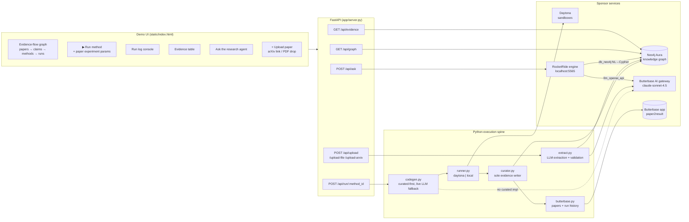
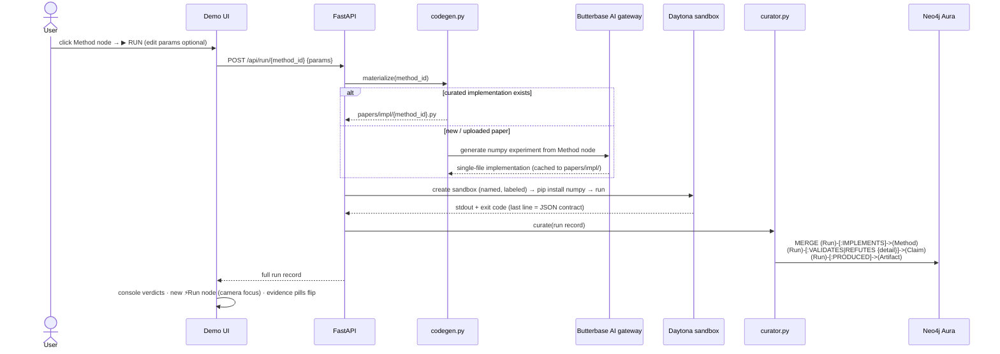
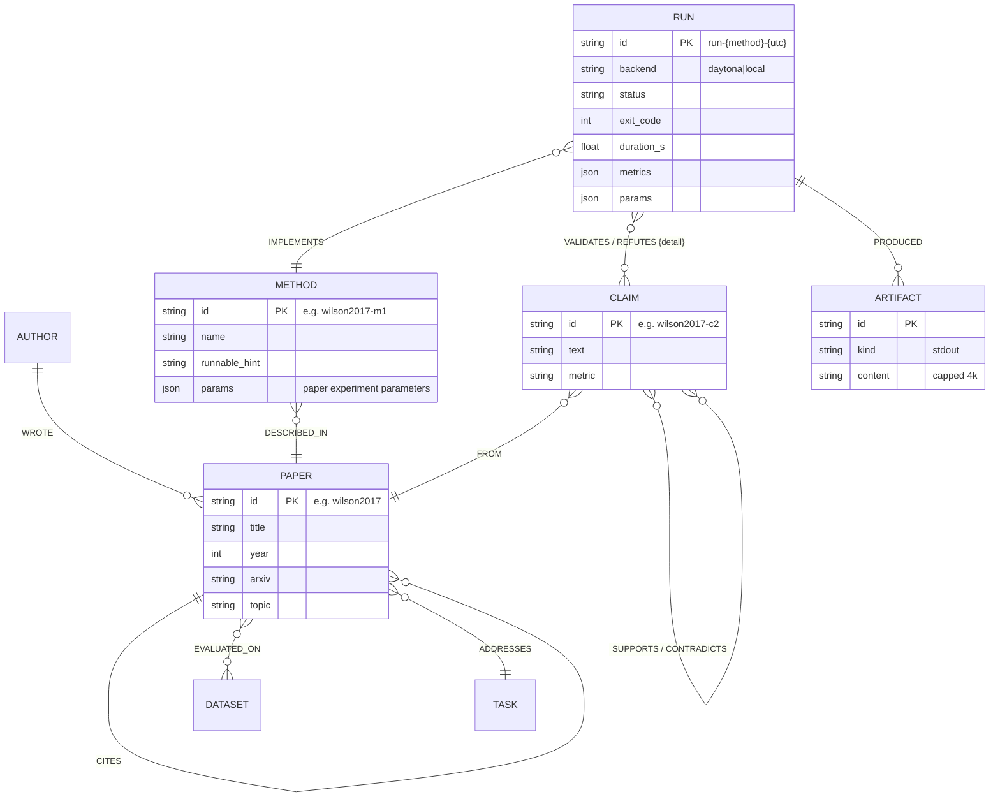
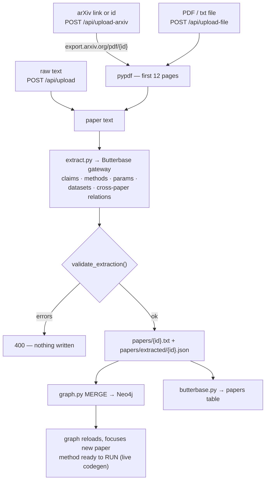
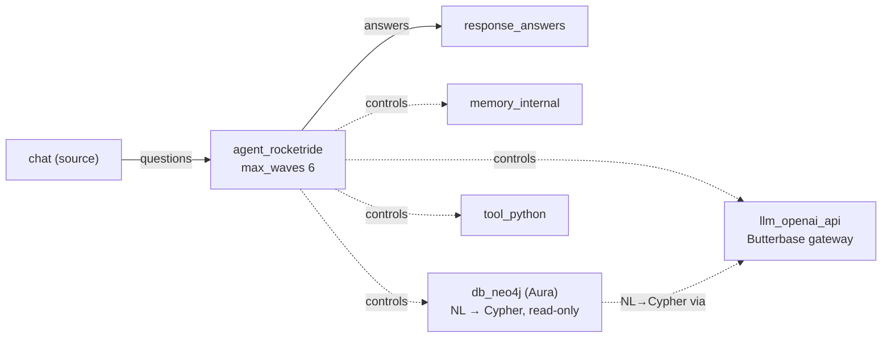

# Paper→Results Graph

**Turn research papers into executable evidence.**

Most research tools stop at summaries. Paper→Results closes the loop between what papers *claim* and what actually *runs*:

> **Paper → Claim → Method → Code → Sandbox Run → Result → Graph Update**

Select a method from a paper (or upload any paper via arXiv link / PDF), generate a runnable implementation, execute it in a sandbox, and watch the result attach itself to the knowledge graph — `VALIDATES` or `REFUTES`, with logs, metrics, params, and failure data. The graph doesn't just know what papers say. It knows what has been tested.

Built for **HackwithBay 3.0** (July 7, 2026) — *Thoughtful Agents for Productivity*.

---

## System architecture



**One LLM route for everything:** extraction, code generation, and the agent pipeline all go through the Butterbase AI gateway (OpenAI-compatible `/v1/{app_id}/chat/completions`) — no OpenAI key anywhere in the project.

---

## The closed loop (killer demo moment)



Every run script obeys one contract: **the last stdout line is a JSON object** `{method_id, params, metrics, claim_checks:[{claim_id, verdict, detail}]}` — verdicts are computed from measured metrics, never hardcoded. **Failed runs are curated too**: the error and logs become graph evidence.

---

## Knowledge graph model



The Aura instance is shared with another project, so **every destructive operation is scoped to these labels** (`OUR_LABELS` in `app/db.py`) — never label-less deletes.

---

## Upload / ingestion flow



The extraction prompt knows the existing corpus, so new papers arrive **already linked** — e.g. uploading Wilson et al. adds `CONTRADICTS` edges against Adam's claims.

---

## RocketRide agent pipeline (`pipelines/paper2result.pipe`)



The **Ask the research agent** panel routes here (FastAPI keeps one cached pipeline session; on "Pipeline is already running" it re-attaches via `get_task_token`). The agent answers evidence questions by querying the live graph — citing claim ids, run ids, and exact metrics.

> **`multi-agent-orchestration` branch:** a Conductor workflow engine over specialist sub-agent pipes (Investigator → Executor → Reporter) with machine-parseable `---P2R---` contracts, acceptance checks (V/E/R gates), corrective retries, a graph self-heal guard, and per-agent check scripts. See `scripts/check_orchestration.py` on that branch.

---

## Sponsor stack

| Partner | How it's used |
|---|---|
| **RocketRide** (local engine) | Wave agent + internal memory + `db_neo4j` NL→Cypher tool + `tool_python`; one LLM node powers agent and Cypher generation |
| **Neo4j Aura** | The product *is* the graph — papers, claims, methods, runs, `CONTRADICTS`/`VALIDATES`/`REFUTES` edges |
| **Butterbase** | AI gateway powers **all** LLM calls (extraction, codegen, agent) + dedicated `paper2result` app persists papers & run history |
| **Daytona** | Named, labeled sandboxes per run (visible in the dashboard, auto-cleanup); `--backend auto` prefers Daytona, local subprocess keeps the demo unkillable |

---

## Repo map

```
app/
  extract.py     paper text → validated {claims, methods, params, relations} (gateway LLM; --mock golden files)
  graph.py       idempotent Neo4j MERGE loader (+ label-scoped --reset)
  queries.py     canned queries: claims / conflicts / methods / evidence
  codegen.py     Method node → runnable numpy experiment (curated-first, live LLM + cache)
  runner.py      execute in daytona|local, P2R_* param env, persist runs/{run_id}.json
  curator.py     sole graph evidence writer: Run/Artifact + IMPLEMENTS/VALIDATES/REFUTES
  butterbase.py  papers + runs tables in the paper2result Butterbase app
  server.py      FastAPI: graph/evidence/run/ask/upload×3
  db.py          shared driver, certifi fix, OUR_LABELS guard
papers/          paper texts · extracted/ golden JSON · impl/ implementations
pipelines/       paper2result.pipe (RocketRide agent)
scripts/         check_neo4j · check_pipeline · demo_loop · reset_demo
static/          the demo UI (single file)
BUILD_LOOP.md    autonomous build log — this project was built by a self-pacing
                 agent loop; every milestone gate-checked before commit
```

---

## Run it

```bash
python3 -m venv .venv && .venv/bin/pip install -r requirements.txt
cp .env.example .env        # Neo4j Aura, Butterbase keys, ROCKETRIDE_*, DAYTONA_API_KEY

.venv/bin/python scripts/check_neo4j.py       # graph connectivity
.venv/bin/python app/graph.py --reset         # load the seed papers
.venv/bin/python scripts/check_pipeline.py    # RocketRide agent smoke test

.venv/bin/uvicorn app.server:app --port 8787  # → http://localhost:8787
```

One-command closed loop without the UI:

```bash
.venv/bin/python scripts/demo_loop.py wilson2017-m1
#   wilson2017-c1: 'no runs yet' -> 'VALIDATES by run-wilson2017-m1-...'
#   wilson2017-c2: 'no runs yet' -> 'VALIDATES by run-wilson2017-m1-...'
# loop CLOSED ✓: paper → method → code → daytona run → result → graph
```

Before a live demo: `.venv/bin/python scripts/reset_demo.py` (pristine "no runs yet" state; uploaded papers stay).

---

## The science is real

The flagship experiment reproduces **Wilson et al. 2017** (arXiv:1705.08292): on their linearly-separable construction, gradient descent reaches **0.000 test error while Adam hits 0.425** — and Adam's first three weights equalize exactly as the paper's theory predicts. Editing the paper's experiment parameters in the UI (e.g. `p_pos`, `steps`, learning rates) re-runs the experiment under new settings, and each configuration becomes its own Run node — including honest **REFUTES** verdicts when a claim doesn't hold under the tested settings.

## Status

| Component | Status |
|---|---|
| Extraction — golden + live LLM (arXiv/PDF/text) | ✅ verified |
| Neo4j knowledge graph + conflict queries | ✅ verified |
| Codegen — curated + live LLM for any method | ✅ verified |
| Runner — Daytona sandbox + local fallback | ✅ verified |
| Closed loop → evidence flip | ✅ verified |
| RocketRide agent (graph Q&A with citations) | ✅ verified |
| Demo UI (graph, params, console, evidence, ask, upload) | ✅ verified |
| Butterbase (gateway LLM + persistence) | ✅ verified |
| Multi-agent Conductor (branch) | ✅ Playbook A gate passes |

## Why this beats "Paper2Code"

Paper2Code stops at code generation. Here, the code **runs**, and the outcome — success, failure, error, metric — becomes a first-class graph citizen attached to the claims it tests.

> Research should not end at reading. It should end in evidence.
