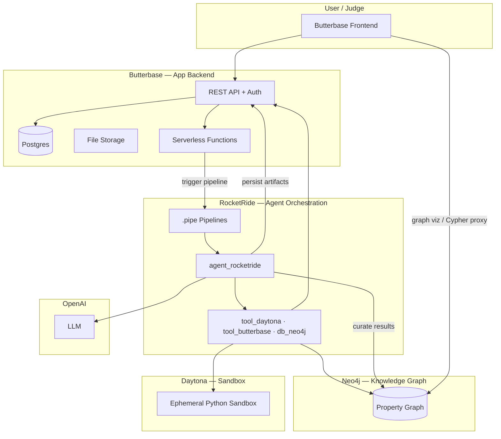
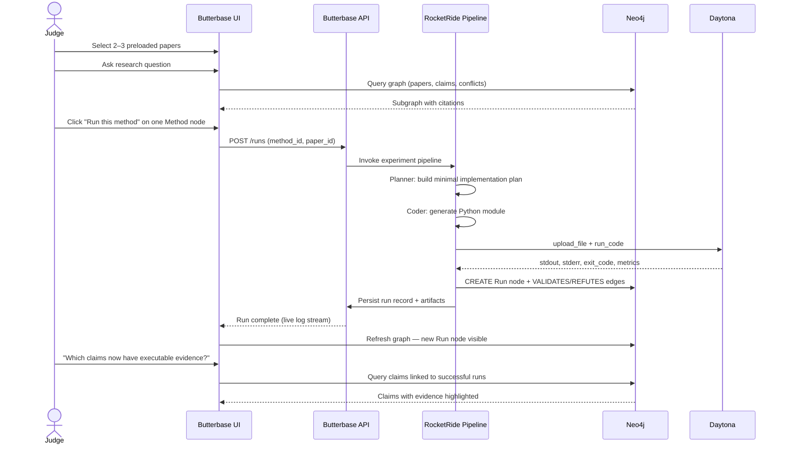
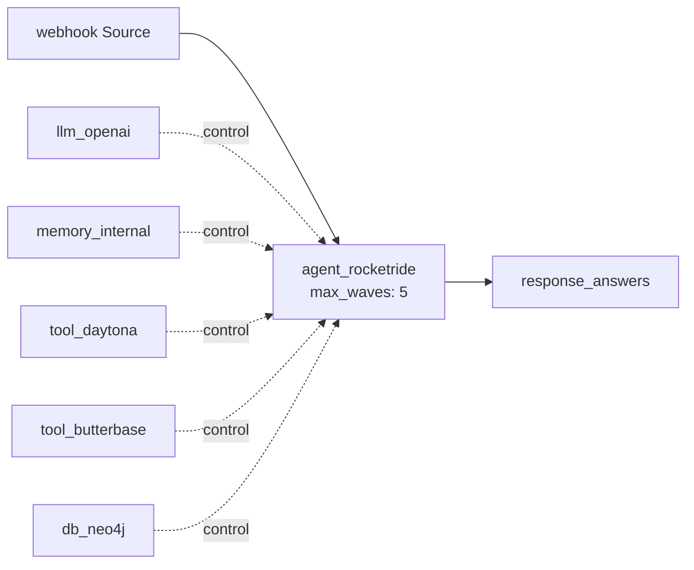
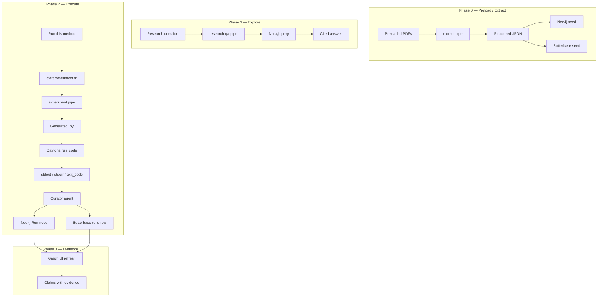
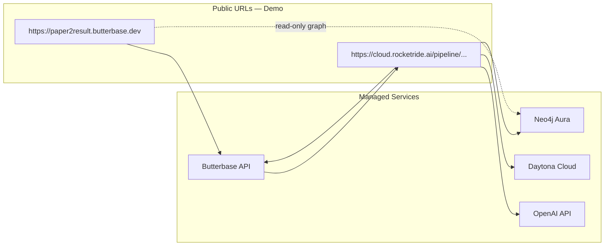
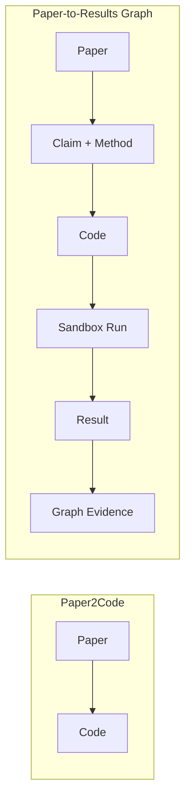

# Paper-to-Results Graph — Architecture

> **Repo:** [github.com/samshanmukh/Paper-to-Results-Graph](https://github.com/samshanmukh/Paper-to-Results-Graph)  
> **Event:** HackwithBay 3.0 — *Thoughtful Agents for Productivity*  
> **Core loop:** Paper → Claim → Method → Code → Sandbox Run → Result → Graph Update

---

## 1. Vision

Paper-to-Results Graph turns research papers into **executable evidence**.

Most research tools stop at summaries or citation graphs. This system closes the loop between what a paper **claims** and what has actually been **tested**:

| Question | Traditional tools | Paper-to-Results Graph |
|----------|-------------------|------------------------|
| What does the paper claim? | ✅ Summaries, citations | ✅ Claims in knowledge graph |
| Can I run the method? | ❌ Manual reimplementation | ✅ One-click code generation |
| Did the code run? | ❌ Unknown | ✅ Run node with status |
| What failed? | ❌ Unknown | ✅ Captured stderr / error |
| What metric was produced? | ❌ Unknown | ✅ Benchmark result on Run node |
| Which claim does this support? | ❌ Unknown | ✅ `VALIDATES` / `REFUTES` edges |

**One-line pitch:** Research should not end at reading. It should end in evidence.

---

## 2. Design Principles

### 2.1 Smallest closed loop (hackathon scope)

Build exactly one end-to-end path:

```
one paper → one method → one runnable experiment → one result → graph update
```

### 2.2 Explicit boundaries

| Build | Do not build |
|-------|--------------|
| Preload 2–3 papers on one topic | Full arbitrary PDF-to-code system |
| Extract claims + methods to structured JSON | Perfect paper parser |
| Graph nodes + edges in Neo4j | General research chatbot |
| Click one method → generate small Python impl | Huge graph explorer |
| Run in Daytona sandbox | Complex benchmark suite |
| Capture result → write back to graph | Multi-paper code synthesis |
| Simple graph visualization | Automatic scientific validation |

### 2.3 Separation of concerns

| System | Owns |
|--------|------|
| **Neo4j** | Research knowledge graph — papers, claims, methods, citations, runs, evidence relationships |
| **Butterbase** | Application backend — paper metadata, artifacts, run history, user session, deployed UI |
| **Daytona** | Ephemeral code execution — isolated sandboxes, stdout/stderr, exit codes |
| **RocketRide** | Agent orchestration — extract → plan → code → run → curate |
| **OpenAI / LLM** | Extraction, planning, code generation, result explanation |

Neo4j answers *"what is connected and what evidence exists?"*  
Butterbase answers *"what did the app store and serve to the user?"*  
Daytona answers *"did the code actually run?"*

---

## 3. System Context



### Sponsor mapping

| Partner | Role in architecture |
|---------|---------------------|
| **Neo4j** | Canonical research graph: papers, claims, methods, datasets, citations, runs, results |
| **Daytona** | Safe execution of generated code in isolated sandboxes |
| **Butterbase** | Papers, artifacts, generated files, run history, user feedback, live demo URL |
| **RocketRide** | Multi-wave pipeline: extract → generate → run → update graph |
| **OpenAI** | Claim extraction, implementation plan, code generation, result explanation |

---

## 4. Core User Flows

### 4.1 Demo flow (2 minutes)



### 4.2 Killer demo moment

The judge clicks **Run this method**. The UI shows, in order:

1. Code generated  
2. Sandbox started  
3. Experiment running (live log)  
4. Output captured  
5. Result saved  
6. Graph updated  

Closing line: *"The graph now knows not only what the paper claimed, but what actually ran."*

---

## 5. Component Architecture

### 5.1 Frontend (Butterbase-hosted)

A React/Vite SPA deployed via Butterbase frontend deployment.

| Screen | Purpose |
|--------|---------|
| **Paper library** | Browse 2–3 preloaded papers; show title, authors, abstract |
| **Graph explorer** | Visualize papers, claims, methods, citations (read-only for demo) |
| **Research Q&A** | Ask cross-paper questions; show cited claims from graph |
| **Method detail** | Show method description + **Run this method** CTA |
| **Run console** | Live execution log, exit status, captured output |
| **Evidence view** | Highlight claims with linked `Run` nodes |

**Tech:** React + Vite, `@butterbase/sdk` for auth/data, graph viz library (e.g. `react-force-graph` or Neo4j NVL), WebSocket or polling for run status.

### 5.2 Butterbase backend

Postgres tables hold **application state** and **artifacts**. Neo4j holds **semantic research relationships**.

#### Schema (declarative JSON)

```json
{
  "tables": [
    {
      "name": "papers",
      "columns": [
        { "name": "id", "type": "uuid", "primaryKey": true },
        { "name": "title", "type": "text", "nullable": false },
        { "name": "authors", "type": "text" },
        { "name": "abstract", "type": "text" },
        { "name": "pdf_object_id", "type": "text" },
        { "name": "neo4j_paper_id", "type": "text", "nullable": false },
        { "name": "topic", "type": "text" },
        { "name": "created_at", "type": "timestamptz", "default": "now()" }
      ]
    },
    {
      "name": "methods",
      "columns": [
        { "name": "id", "type": "uuid", "primaryKey": true },
        { "name": "paper_id", "type": "uuid", "references": "papers.id" },
        { "name": "name", "type": "text", "nullable": false },
        { "name": "description", "type": "text" },
        { "name": "neo4j_method_id", "type": "text", "nullable": false },
        { "name": "language", "type": "text", "default": "'python'" }
      ]
    },
    {
      "name": "runs",
      "columns": [
        { "name": "id", "type": "uuid", "primaryKey": true },
        { "name": "method_id", "type": "uuid", "references": "methods.id" },
        { "name": "paper_id", "type": "uuid", "references": "papers.id" },
        { "name": "status", "type": "text", "nullable": false },
        { "name": "exit_code", "type": "integer" },
        { "name": "stdout", "type": "text" },
        { "name": "stderr", "type": "text" },
        { "name": "metric_name", "type": "text" },
        { "name": "metric_value", "type": "text" },
        { "name": "code_object_id", "type": "text" },
        { "name": "log_object_id", "type": "text" },
        { "name": "neo4j_run_id", "type": "text" },
        { "name": "started_at", "type": "timestamptz" },
        { "name": "finished_at", "type": "timestamptz" }
      ]
    },
    {
      "name": "feedback",
      "columns": [
        { "name": "id", "type": "uuid", "primaryKey": true },
        { "name": "run_id", "type": "uuid", "references": "runs.id" },
        { "name": "rating", "type": "integer" },
        { "name": "comment", "type": "text" },
        { "name": "created_at", "type": "timestamptz", "default": "now()" }
      ]
    }
  ]
}
```

`status` values: `pending` | `generating` | `running` | `succeeded` | `failed`

#### Serverless functions

| Function | Trigger | Responsibility |
|----------|---------|----------------|
| `start-experiment` | HTTP POST | Validate input, create `runs` row (`pending`), invoke RocketRide pipeline webhook |
| `get-run-status` | HTTP GET | Return run record + presigned URLs for code/logs |
| `graph-query` | HTTP POST | Proxy safe, read-only Cypher queries for frontend graph viz |

RLS: optional for hackathon demo (single demo user); enable `user_id` column if multi-user.

### 5.3 Neo4j knowledge graph

Neo4j is the **source of truth for research semantics**. Butterbase `neo4j_*_id` columns link app rows to graph nodes.

#### Node labels

| Label | Key properties | Description |
|-------|----------------|-------------|
| `Paper` | `id`, `title`, `year`, `doi`, `abstract` | Research paper |
| `Author` | `id`, `name` | Paper author |
| `Claim` | `id`, `text`, `confidence`, `section` | Assertion from a paper |
| `Method` | `id`, `name`, `description`, `complexity` | Implementable technique |
| `Dataset` | `id`, `name`, `url` | Dataset referenced |
| `Task` | `id`, `name`, `metric` | Evaluation task |
| `Run` | `id`, `status`, `exit_code`, `metric_value`, `stdout_preview` | Experiment execution |
| `Artifact` | `id`, `type`, `storage_ref` | Generated code, logs, plots |

#### Relationship types

```cypher
(Author)-[:WROTE]->(Paper)
(Paper)-[:CITES]->(Paper)
(Claim)-[:FROM]->(Paper)
(Method)-[:DESCRIBED_IN]->(Paper)
(Method)-[:USES]->(Dataset)
(Method)-[:ADDRESSES]->(Task)
(Claim)-[:SUPPORTS]->(Claim)
(Claim)-[:CONTRADICTS]->(Claim)
(Run)-[:IMPLEMENTS]->(Method)
(Run)-[:EXECUTED_ON]->(Dataset)
(Run)-[:PRODUCED]->(Artifact)
(Run)-[:VALIDATES]->(Claim)    // successful run strengthens claim
(Run)-[:REFUTES]->(Claim)      // failed run or negative metric weakens claim
```

#### Example evidence query

```cypher
// Claims with executable evidence
MATCH (c:Claim)<-[:VALIDATES]-(r:Run {status: 'succeeded'})
MATCH (c)-[:FROM]->(p:Paper)
RETURN c.text AS claim, p.title AS paper, r.metric_value AS evidence
ORDER BY r.finished_at DESC
```

### 5.4 RocketRide pipelines

RocketRide orchestrates the agent loop. Pipelines are portable `.pipe` JSON graphs deployed to RocketRide Cloud for the live demo.

#### Pipeline catalog

| Pipeline | Entry | Purpose |
|----------|-------|---------|
| `extract.pipe` | `dropper` / batch | PDF → structured JSON → Neo4j seed (offline, run once) |
| `experiment.pipe` | `webhook` | method_id → plan → code → Daytona run → graph update |
| `research-qa.pipe` | `chat` / `webhook` | Natural-language question → `db_neo4j` GraphRAG answer |

#### `experiment.pipe` — core closed loop



**Agent instructions (summary):**

1. Load method + paper context from Butterbase and Neo4j  
2. Plan a **minimal** runnable Python implementation (single file, stdlib + one pip dep max)  
3. Upload code to Daytona via `upload_file`, execute via `run_code`  
4. Parse stdout for a metric (regex or simple JSON line)  
5. Create `Run` node in Neo4j with `VALIDATES` or `REFUTES` edge to target claim  
6. Update Butterbase `runs` row with status, logs, artifacts  

#### Agent roles

| Agent role | Pipeline stage | Tools / nodes |
|------------|----------------|---------------|
| **Extractor** | `extract.pipe` | `parse` PDF, LLM extraction, `db_neo4j` write |
| **Linker** | `extract.pipe` | LLM + `db_neo4j` — citations, SUPPORTS/CONTRADICTS |
| **Planner** | `experiment.pipe` wave 1 | `memory_internal`, read Method + Claim context |
| **Coder** | `experiment.pipe` wave 2–3 | `tool_daytona.upload_file`, LLM code gen |
| **Runner** | `experiment.pipe` wave 4 | `tool_daytona.run_code` |
| **Curator** | `experiment.pipe` wave 5 | `db_neo4j` + `tool_butterbase` — persist Run + artifacts |

### 5.5 Daytona sandbox

Execution is delegated to Daytona's `tool_daytona` node inside RocketRide.

| Setting | Value | Rationale |
|---------|-------|-----------|
| `language` | `python` | Simplest demo path |
| `auto_stop_minutes` | `5` | Cost safety |
| `exec_timeout_secs` | `120` | Enough for small experiments |
| `max_output_chars` | `50000` | Protect agent context window |

**Execution contract for generated code:**

```python
# Generated scripts must print a parseable result line:
# METRIC: accuracy=0.87
# or
# {"metric": "accuracy", "value": 0.87}
```

The Curator agent parses this line and writes `metric_name` / `metric_value` to both Neo4j and Butterbase.

---

## 6. Data Flow — Closed Loop Detail



---

## 7. Extraction Schema (Structured JSON)

Offline extraction produces this JSON per paper. It seeds both Neo4j and Butterbase.

```json
{
  "paper": {
    "id": "paper_001",
    "title": "Example Paper on Topic X",
    "authors": ["Alice Smith", "Bob Jones"],
    "year": 2024,
    "abstract": "...",
    "citations": ["paper_002"]
  },
  "claims": [
    {
      "id": "claim_001",
      "text": "Method X achieves 90% accuracy on Dataset Y",
      "section": "Results",
      "confidence": 0.9
    }
  ],
  "methods": [
    {
      "id": "method_001",
      "name": "Baseline Classifier",
      "description": "Train a logistic regression on feature set Z",
      "complexity": "low",
      "datasets": ["dataset_y"],
      "addressed_claims": ["claim_001"]
    }
  ],
  "datasets": [
    {
      "id": "dataset_y",
      "name": "Dataset Y",
      "url": "https://example.com/dataset-y"
    }
  ],
  "tasks": [
    {
      "id": "task_classification",
      "name": "Binary Classification",
      "metric": "accuracy"
    }
  ]
}
```

For the hackathon, **pre-extract** this JSON manually or via one-shot `extract.pipe` run. Do not depend on live PDF parsing during the demo.

---

## 8. API Contracts

### 8.1 Start experiment

```
POST /v1/{app_id}/fn/start-experiment
```

```json
{
  "method_id": "uuid",
  "paper_id": "uuid",
  "claim_id": "claim_001"
}
```

Response:

```json
{
  "run_id": "uuid",
  "status": "pending"
}
```

### 8.2 RocketRide webhook payload (`experiment.pipe`)

```json
{
  "run_id": "uuid",
  "method_id": "uuid",
  "paper_id": "uuid",
  "neo4j_method_id": "method_001",
  "neo4j_claim_id": "claim_001",
  "target_metric": "accuracy"
}
```

### 8.3 Run status

```
GET /v1/{app_id}/data/runs?id=eq.{run_id}
```

```json
{
  "id": "uuid",
  "status": "succeeded",
  "exit_code": 0,
  "metric_name": "accuracy",
  "metric_value": "0.87",
  "stdout": "...",
  "stderr": ""
}
```

---

## 9. Deployment Topology



| Component | Deployment target |
|-----------|-------------------|
| Frontend | Butterbase `create_frontend_deployment` |
| Backend schema + functions | Butterbase MCP `manage_schema`, `deploy_function` |
| Pipelines | RocketRide Cloud (shareable URL, not localhost) |
| Graph DB | Neo4j Aura free tier |
| Sandboxes | Daytona Cloud (`DAYTONA_API_KEY`) |

---

## 10. Repository Layout (Target)

```
.
├── README.md
├── docs/
│   ├── ARCHITECTURE.md          # This document
│   └── EXECUTION_PLAN.md        # Hackathon task board
├── frontend/                    # React/Vite SPA → Butterbase deploy
│   ├── src/
│   │   ├── components/          # GraphViz, RunConsole, PaperList
│   │   └── lib/butterbase.ts
│   └── package.json
├── pipelines/                   # RocketRide .pipe files
│   ├── extract.pipe
│   ├── experiment.pipe
│   └── research-qa.pipe
├── seed/                        # Pre-extracted paper JSON + PDFs
│   ├── papers/
│   └── neo4j/
│       └── seed.cypher
├── scripts/
│   ├── seed_neo4j.py
│   └── verify_daytona.py        # Daytona SDK smoke test
├── .env.example
└── reference/                   # Partner docs (existing)
```

---

## 11. Security & Safety

| Concern | Mitigation |
|---------|------------|
| Arbitrary code execution | Daytona isolated sandbox only; never run on engine host |
| Sandbox cost | `auto_stop_minutes: 5`, ephemeral sandboxes |
| Graph injection | Frontend uses parameterized read-only Cypher whitelist |
| API keys | `.env` locally; Butterbase function env vars in production |
| Generated code scope | Agent instructions: single file, no network calls, no filesystem escape |

---

## 12. Failure Modes

| Failure | System behavior | Graph update |
|---------|-----------------|--------------|
| Code generation fails | `runs.status = failed`, no Daytona call | No Run node (or Run with `status: failed`) |
| Sandbox timeout | `exit_code: -1`, stderr captured | `Run` with `REFUTES` or neutral edge |
| Non-zero exit code | `status: failed`, full stderr stored | `Run` node + `REFUTES` claim |
| Metric not parseable | `status: succeeded` but `metric_value: null` | `Run` node without VALIDATES edge |
| Pipeline crash | Butterbase run stuck `pending` → timeout job marks `failed` | Manual cleanup |

Failed runs are **first-class evidence**. The graph should show what was attempted and why it failed.

---

## 13. Success Criteria

The hackathon build is complete when a judge can:

- [ ] See 2–3 preloaded papers on the same topic  
- [ ] View a graph of papers, claims, methods, and citations  
- [ ] Ask a cross-paper research question and get a cited answer  
- [ ] Click **Run this method** on one method  
- [ ] Watch code generation and sandbox execution live  
- [ ] See a new `Run` node on the graph after completion  
- [ ] Ask which claims now have executable evidence  
- [ ] Access everything via a **live Butterbase URL** (not localhost)  

---

## 14. Why This Beats Paper2Code



Paper2Code stops at code generation. Paper-to-Results Graph answers:

- Did the code run?  
- Did it fail? What error?  
- What metric did it produce?  
- Which claim does the result support or weaken?  
- Which paper now has executable evidence attached?  

---

## 15. References

- [README](../README.md) — project overview  
- [Butterbase reference](../reference/butterbase-reference.md)  
- [Neo4j reference](../reference/neo4j-reference.md)  
- [RocketRide reference](../reference/rocketride-reference.md)  
- [Problem statement](../reference/problem-statement.md)  
- [HackwithBay prep](../reference/hackwithbay-3.0-prep.md)  

---

*Architecture v1.0 — HackwithBay 3.0, July 7, 2026*
