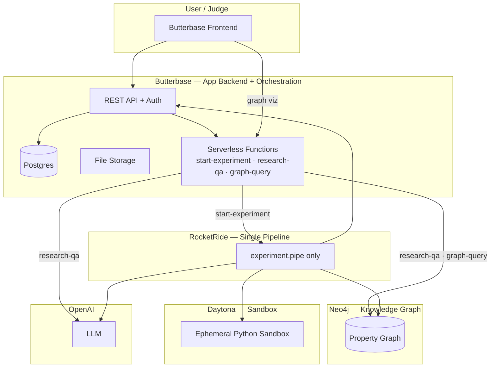
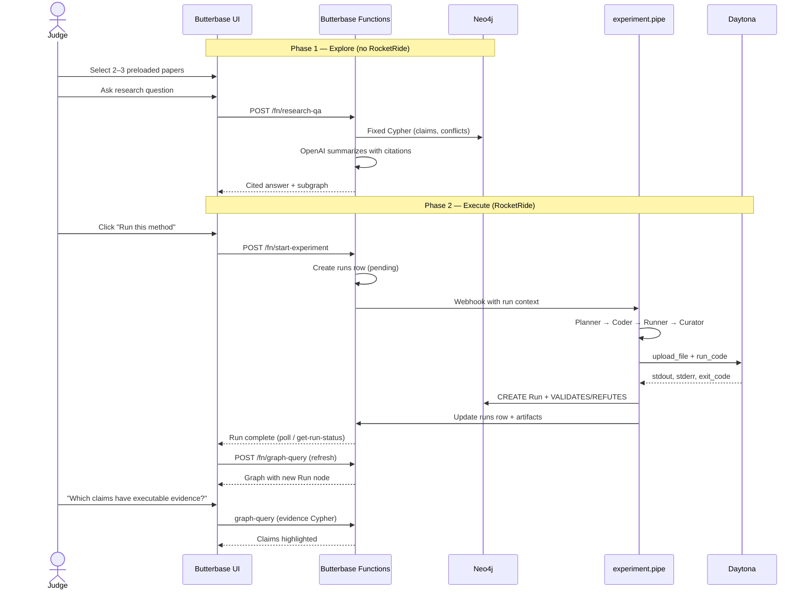
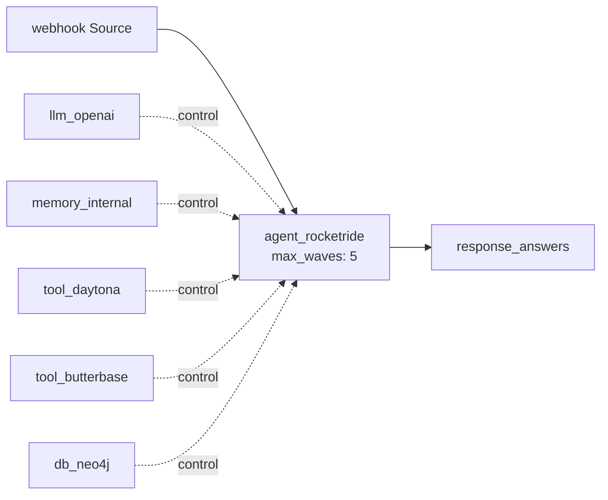
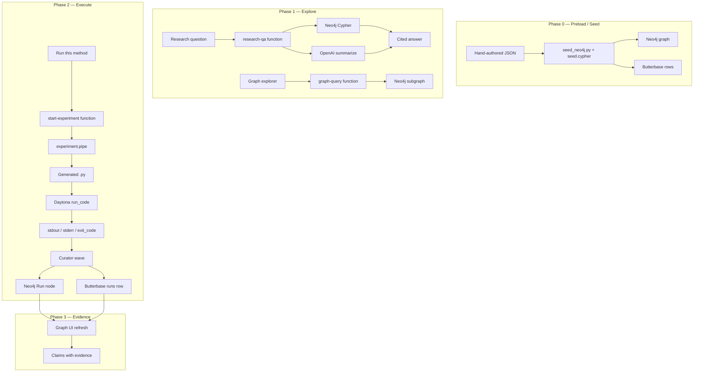
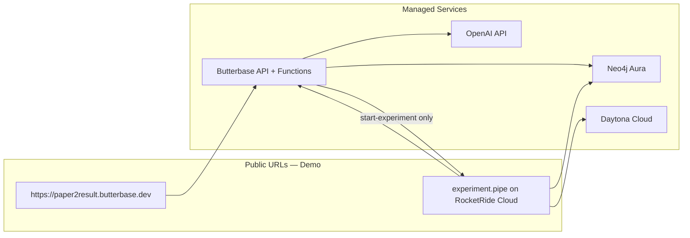
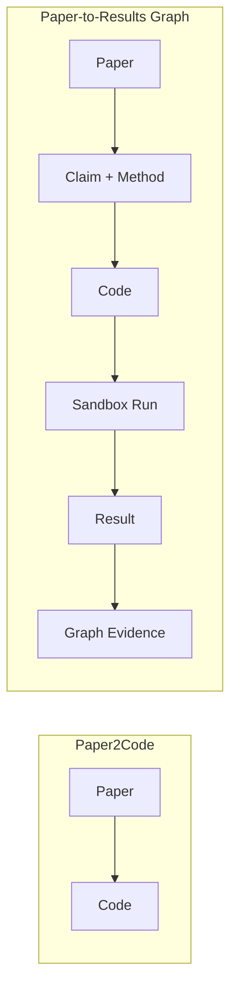

# Paper-to-Results Graph — Architecture

> **Repo:** [github.com/samshanmukh/Paper-to-Results-Graph](https://github.com/samshanmukh/Paper-to-Results-Graph)  
> **Event:** HackwithBay 3.0 — *Thoughtful Agents for Productivity*  
> **Core loop:** Paper → Claim → Method → Code → Sandbox Run → Result → Graph Update

---

## 1. Vision

Paper-to-Results Graph turns research papers into **executable evidence**.

Most research tools stop at summaries or citation graphs. This system closes the loop between what a paper **claims** and what has actually been **tested**:

| Question | Traditional tools | Paper-to-Results Graph |
|----------|-------------------|------------------------|
| What does the paper claim? | ✅ Summaries, citations | ✅ Claims in knowledge graph |
| Can I run the method? | ❌ Manual reimplementation | ✅ One-click code generation |
| Did the code run? | ❌ Unknown | ✅ Run node with status |
| What failed? | ❌ Unknown | ✅ Captured stderr / error |
| What metric was produced? | ❌ Unknown | ✅ Benchmark result on Run node |
| Which claim does this support? | ❌ Unknown | ✅ `VALIDATES` / `REFUTES` edges |

**One-line pitch:** Research should not end at reading. It should end in evidence.

---

## 2. Design Principles

### 2.1 Smallest closed loop (hackathon scope)

Build exactly one end-to-end path:

```
one paper → one method → one runnable experiment → one result → graph update
```

### 2.2 Explicit boundaries

| Build | Do not build |
|-------|--------------|
| Preload 2–3 papers on one topic | Full arbitrary PDF-to-code system |
| Extract claims + methods to structured JSON | Perfect paper parser |
| Graph nodes + edges in Neo4j | General research chatbot |
| Click one method → generate small Python impl | Huge graph explorer |
| Run in Daytona sandbox | Complex benchmark suite |
| Capture result → write back to graph | Multi-paper code synthesis |
| Simple graph visualization | Automatic scientific validation |

### 2.3 Separation of concerns

| System | Owns |
|--------|------|
| **Neo4j** | Research knowledge graph — papers, claims, methods, citations, runs, evidence relationships |
| **Butterbase** | Application backend — paper metadata, artifacts, run history, user session, deployed UI, **most orchestration** |
| **Daytona** | Ephemeral code execution — isolated sandboxes, stdout/stderr, exit codes |
| **RocketRide** | **One pipeline only** — multi-wave agent for the "Run this method" demo moment |
| **OpenAI / LLM** | Extraction (offline), code generation (via RocketRide), Q&A summarization (via Butterbase) |

Neo4j answers *"what is connected and what evidence exists?"*  
Butterbase answers *"what did the app store, serve, and orchestrate?"*  
Daytona answers *"did the code actually run?"*  
RocketRide answers *"can an agent plan, code, run, and curate in one thoughtful loop?"*

### 2.4 Minimal RocketRide strategy

RocketRide is used **as little as possible** while still satisfying sponsor integration.

| Concern | Owner | RocketRide? |
|---------|-------|-------------|
| Paper ingestion / graph seeding | `seed/` scripts + `seed.cypher` | ❌ No |
| Graph visualization | Butterbase frontend + `graph-query` function | ❌ No |
| Research Q&A | Butterbase `research-qa` function (Cypher + OpenAI) | ❌ No |
| Run history / artifacts | Butterbase Postgres + storage | ❌ No |
| **Run this method** (killer demo) | `experiment.pipe` on RocketRide Cloud | ✅ **Yes — only touchpoint** |

```
Pre-seeded graph (scripts)          ← no RocketRide
        ↓
Explore + Q&A (Butterbase fns)      ← no RocketRide
        ↓
Run this method (experiment.pipe)   ← RocketRide (1 pipeline)
        ↓
Graph updated (Neo4j + Butterbase)
```

**Why keep one pipeline?** Judges see a live multi-wave agent (plan → code → run → curate) for the demo climax, without making RocketRide a dependency for every feature.

**Fallback (zero RocketRide):** If RocketRide Cloud is unavailable, `start-experiment` can run the same steps inline (OpenAI + Daytona SDK + Neo4j driver). Keep this as a backup, not the primary path.

---

## 3. System Context



### Sponsor mapping

| Partner | Role in architecture |
|---------|---------------------|
| **Neo4j** | Canonical research graph: papers, claims, methods, datasets, citations, runs, results |
| **Daytona** | Safe execution of generated code in isolated sandboxes |
| **Butterbase** | Papers, artifacts, run history, user feedback, live demo URL, **Q&A and graph proxy** |
| **RocketRide** | **Single** multi-wave agent pipeline for the experiment execution moment |
| **OpenAI** | Offline extraction (manual), code generation (RocketRide), Q&A summarization (Butterbase) |

---

## 4. Core User Flows

### 4.1 Demo flow (2 minutes)



### 4.2 Killer demo moment

The judge clicks **Run this method**. The UI shows, in order:

1. Code generated *(RocketRide agent)*  
2. Sandbox started *(Daytona via `tool_daytona`)*  
3. Experiment running (live log)  
4. Output captured  
5. Result saved *(Butterbase + Neo4j)*  
6. Graph updated  

Closing line: *"The graph now knows not only what the paper claimed, but what actually ran."*

Everything before step 1 (browsing papers, asking questions, viewing the graph) runs on **Butterbase + Neo4j only**.

---

## 5. Component Architecture

### 5.1 Frontend (Butterbase-hosted)

A React/Vite SPA deployed via Butterbase frontend deployment.

| Screen | Purpose | Backend |
|--------|---------|---------|
| **Paper library** | Browse 2–3 preloaded papers | Butterbase `papers` table |
| **Graph explorer** | Visualize papers, claims, methods, citations | `graph-query` function |
| **Research Q&A** | Ask cross-paper questions; cited claims | `research-qa` function |
| **Method detail** | Method description + **Run this method** CTA | Butterbase `methods` table |
| **Run console** | Live execution log, exit status, output | `get-run-status` + polling |
| **Evidence view** | Claims with linked `Run` nodes | `graph-query` (evidence Cypher) |

**Tech:** React + Vite, `@butterbase/sdk` for auth/data, graph viz library (e.g. `react-force-graph`), polling for run status.

### 5.2 Butterbase backend

Postgres holds **application state** and **artifacts**. Neo4j holds **semantic research relationships**. Butterbase functions own **all orchestration except the experiment agent loop**.

#### Schema (declarative JSON)

```json
{
  "tables": [
    {
      "name": "papers",
      "columns": [
        { "name": "id", "type": "uuid", "primaryKey": true },
        { "name": "title", "type": "text", "nullable": false },
        { "name": "authors", "type": "text" },
        { "name": "abstract", "type": "text" },
        { "name": "pdf_object_id", "type": "text" },
        { "name": "neo4j_paper_id", "type": "text", "nullable": false },
        { "name": "topic", "type": "text" },
        { "name": "created_at", "type": "timestamptz", "default": "now()" }
      ]
    },
    {
      "name": "methods",
      "columns": [
        { "name": "id", "type": "uuid", "primaryKey": true },
        { "name": "paper_id", "type": "uuid", "references": "papers.id" },
        { "name": "name", "type": "text", "nullable": false },
        { "name": "description", "type": "text" },
        { "name": "neo4j_method_id", "type": "text", "nullable": false },
        { "name": "language", "type": "text", "default": "'python'" }
      ]
    },
    {
      "name": "runs",
      "columns": [
        { "name": "id", "type": "uuid", "primaryKey": true },
        { "name": "method_id", "type": "uuid", "references": "methods.id" },
        { "name": "paper_id", "type": "uuid", "references": "papers.id" },
        { "name": "status", "type": "text", "nullable": false },
        { "name": "exit_code", "type": "integer" },
        { "name": "stdout", "type": "text" },
        { "name": "stderr", "type": "text" },
        { "name": "metric_name", "type": "text" },
        { "name": "metric_value", "type": "text" },
        { "name": "code_object_id", "type": "text" },
        { "name": "log_object_id", "type": "text" },
        { "name": "neo4j_run_id", "type": "text" },
        { "name": "started_at", "type": "timestamptz" },
        { "name": "finished_at", "type": "timestamptz" }
      ]
    },
    {
      "name": "feedback",
      "columns": [
        { "name": "id", "type": "uuid", "primaryKey": true },
        { "name": "run_id", "type": "uuid", "references": "runs.id" },
        { "name": "rating", "type": "integer" },
        { "name": "comment", "type": "text" },
        { "name": "created_at", "type": "timestamptz", "default": "now()" }
      ]
    }
  ]
}
```

`status` values: `pending` | `generating` | `running` | `succeeded` | `failed`

#### Serverless functions (primary orchestration layer)

| Function | Trigger | Responsibility | RocketRide? |
|----------|---------|----------------|-------------|
| `start-experiment` | HTTP POST | Create `runs` row, invoke `experiment.pipe` webhook | Triggers RR only |
| `get-run-status` | HTTP GET | Return run record + presigned URLs for code/logs | ❌ |
| `graph-query` | HTTP POST | Whitelisted read-only Cypher → JSON for graph viz | ❌ |
| `research-qa` | HTTP POST | Run topic Cypher, pass subgraph to OpenAI, return cited answer | ❌ |

#### `research-qa` function (replaces `research-qa.pipe`)

```typescript
// Pseudocode — runs entirely in Butterbase
async function researchQa(question: string, topic: string) {
  const claims = await neo4j.run(`
    MATCH (c:Claim)-[:FROM]->(p:Paper {topic: $topic})
    OPTIONAL MATCH (c)-[:SUPPORTS|CONTRADICTS]->(other:Claim)
  `, { topic });

  const answer = await openai.chat({
    messages: [
      { role: 'system', content: 'Answer using only the provided claims. Cite claim IDs.' },
      { role: 'user', content: `Question: ${question}\n\nClaims:\n${JSON.stringify(claims)}` }
    ]
  });

  return { answer, claims, citations: extractCitations(answer) };
}
```

No `db_neo4j` GraphRAG node needed — a fixed Cypher template + LLM summarization is enough for 2–3 preloaded papers.

RLS: optional for hackathon demo (single demo user); enable `user_id` column if multi-user.

### 5.3 Neo4j knowledge graph

Neo4j is the **source of truth for research semantics**. Butterbase `neo4j_*_id` columns link app rows to graph nodes.

**Seeding:** `scripts/seed_neo4j.py` + `seed/neo4j/seed.cypher` — no RocketRide pipeline.

#### Node labels

| Label | Key properties | Description |
|-------|----------------|-------------|
| `Paper` | `id`, `title`, `year`, `doi`, `abstract` | Research paper |
| `Author` | `id`, `name` | Paper author |
| `Claim` | `id`, `text`, `confidence`, `section` | Assertion from a paper |
| `Method` | `id`, `name`, `description`, `complexity` | Implementable technique |
| `Dataset` | `id`, `name`, `url` | Dataset referenced |
| `Task` | `id`, `name`, `metric` | Evaluation task |
| `Run` | `id`, `status`, `exit_code`, `metric_value`, `stdout_preview` | Experiment execution |
| `Artifact` | `id`, `type`, `storage_ref` | Generated code, logs, plots |

#### Relationship types

```cypher
(Author)-[:WROTE]->(Paper)
(Paper)-[:CITES]->(Paper)
(Claim)-[:FROM]->(Paper)
(Method)-[:DESCRIBED_IN]->(Paper)
(Method)-[:USES]->(Dataset)
(Method)-[:ADDRESSES]->(Task)
(Claim)-[:SUPPORTS]->(Claim)
(Claim)-[:CONTRADICTS]->(Claim)
(Run)-[:IMPLEMENTS]->(Method)
(Run)-[:EXECUTED_ON]->(Dataset)
(Run)-[:PRODUCED]->(Artifact)
(Run)-[:VALIDATES]->(Claim)
(Run)-[:REFUTES]->(Claim)
```

#### Example evidence query

```cypher
MATCH (c:Claim)<-[:VALIDATES]-(r:Run {status: 'succeeded'})
MATCH (c)-[:FROM]->(p:Paper)
RETURN c.text AS claim, p.title AS paper, r.metric_value AS evidence
ORDER BY r.finished_at DESC
```

### 5.4 RocketRide — single pipeline only

RocketRide is used for **one thing**: the multi-wave experiment agent triggered by **Run this method**.

| Pipeline | Runtime? | Purpose |
|----------|----------|---------|
| `experiment.pipe` | ✅ **Yes** | plan → code → Daytona run → graph update |
| ~~`extract.pipe`~~ | ❌ Removed | Replaced by `seed/` scripts (offline) |
| ~~`research-qa.pipe`~~ | ❌ Removed | Replaced by Butterbase `research-qa` function |

#### `experiment.pipe` — the only RocketRide touchpoint



**Agent instructions (summary):**

1. Load method + paper context from Butterbase (`tool_butterbase`) and Neo4j (`db_neo4j`)  
2. Plan a **minimal** runnable Python implementation (single file, stdlib + one pip dep max)  
3. Upload code to Daytona via `upload_file`, execute via `run_code`  
4. Parse stdout for a metric (regex or simple JSON line)  
5. Create `Run` node in Neo4j with `VALIDATES` or `REFUTES` edge to target claim  
6. Update Butterbase `runs` row with status, logs, artifacts  

#### Agent waves inside `experiment.pipe`

| Wave | Role | Tools |
|------|------|-------|
| 1 | **Planner** | `memory_internal`, read Method + Claim from Neo4j/Butterbase |
| 2–3 | **Coder** | LLM code gen, `tool_daytona.upload_file` |
| 4 | **Runner** | `tool_daytona.run_code` |
| 5 | **Curator** | `db_neo4j` write Run node, `tool_butterbase` update runs row |

#### Zero-RocketRide fallback

If RocketRide Cloud is down, `start-experiment` runs the same steps sequentially:

```
OpenAI (code gen) → Daytona SDK (run) → Neo4j driver (graph) → Butterbase API (persist)
```

Ship `experiment.pipe` as primary; implement fallback only if time allows.

### 5.5 Daytona sandbox

Execution happens inside RocketRide via `tool_daytona` during the demo. The fallback path uses the Daytona SDK directly from a Butterbase function.

| Setting | Value | Rationale |
|---------|-------|-----------|
| `language` | `python` | Simplest demo path |
| `auto_stop_minutes` | `5` | Cost safety |
| `exec_timeout_secs` | `120` | Enough for small experiments |
| `max_output_chars` | `50000` | Protect agent context window |

**Execution contract for generated code:**

```python
# Generated scripts must print a parseable result line:
# METRIC: accuracy=0.87
# or
# {"metric": "accuracy", "value": 0.87}
```

The Curator wave parses this line and writes `metric_name` / `metric_value` to Neo4j and Butterbase.

---

## 6. Data Flow — Closed Loop Detail



**RocketRide appears only in Phase 2.**

---

## 7. Extraction & Seeding (No RocketRide)

Paper data is **pre-extracted offline** and committed to the repo. No live PDF parsing during the demo.

### Structured JSON per paper

```json
{
  "paper": {
    "id": "paper_001",
    "title": "Example Paper on Topic X",
    "authors": ["Alice Smith", "Bob Jones"],
    "year": 2024,
    "abstract": "...",
    "citations": ["paper_002"]
  },
  "claims": [
    {
      "id": "claim_001",
      "text": "Method X achieves 90% accuracy on Dataset Y",
      "section": "Results",
      "confidence": 0.9
    }
  ],
  "methods": [
    {
      "id": "method_001",
      "name": "Baseline Classifier",
      "description": "Train a logistic regression on feature set Z",
      "complexity": "low",
      "datasets": ["dataset_y"],
      "addressed_claims": ["claim_001"]
    }
  ],
  "datasets": [
    { "id": "dataset_y", "name": "Dataset Y", "url": "https://example.com/dataset-y" }
  ],
  "tasks": [
    { "id": "task_classification", "name": "Binary Classification", "metric": "accuracy" }
  ]
}
```

### Seeding workflow (one-time, before demo)

```bash
# 1. Load Neo4j
python scripts/seed_neo4j.py seed/papers/*.json

# 2. Load Butterbase (via MCP or SDK)
python scripts/seed_butterbase.py seed/papers/*.json
```

Extraction can be done manually, with Cursor + OpenAI, or by prototyping prompts in VS Code — but **not** as a runtime RocketRide pipeline.

---

## 8. API Contracts

### 8.1 Start experiment

```
POST /v1/{app_id}/fn/start-experiment
```

```json
{
  "method_id": "uuid",
  "paper_id": "uuid",
  "claim_id": "claim_001"
}
```

Response:

```json
{ "run_id": "uuid", "status": "pending" }
```

### 8.2 RocketRide webhook payload (`experiment.pipe`)

```json
{
  "run_id": "uuid",
  "method_id": "uuid",
  "paper_id": "uuid",
  "neo4j_method_id": "method_001",
  "neo4j_claim_id": "claim_001",
  "target_metric": "accuracy"
}
```

### 8.3 Research Q&A

```
POST /v1/{app_id}/fn/research-qa
```

```json
{
  "question": "Do these papers agree on accuracy benchmarks?",
  "topic": "topic_x"
}
```

Response:

```json
{
  "answer": "Paper A claims 90% accuracy while Paper B reports 85%...",
  "citations": ["claim_001", "claim_003"],
  "conflicts": [{ "claim_a": "claim_001", "claim_b": "claim_003", "type": "CONTRADICTS" }]
}
```

### 8.4 Graph query

```
POST /v1/{app_id}/fn/graph-query
```

```json
{ "query_type": "subgraph", "topic": "topic_x" }
```

Allowed `query_type` values (whitelist only): `subgraph`, `evidence`, `conflicts`.

### 8.5 Run status

```
GET /v1/{app_id}/data/runs?id=eq.{run_id}
```

---

## 9. Deployment Topology



| Component | Deployment target | RocketRide? |
|-----------|-------------------|-------------|
| Frontend | Butterbase `create_frontend_deployment` | ❌ |
| Schema + functions | Butterbase MCP | ❌ |
| Graph DB | Neo4j Aura free tier | ❌ |
| Sandboxes | Daytona Cloud | Via RR `tool_daytona` |
| Experiment agent | RocketRide Cloud — **one** `experiment.pipe` URL | ✅ |

---

## 10. Repository Layout (Target)

```
.
├── README.md
├── docs/
│   ├── ARCHITECTURE.md          # This document
│   └── EXECUTION_PLAN.md        # Hackathon task board
├── frontend/                    # React/Vite SPA → Butterbase deploy
│   ├── src/
│   │   ├── components/          # GraphViz, RunConsole, PaperList, ResearchQA
│   │   └── lib/butterbase.ts
│   └── package.json
├── functions/                   # Butterbase serverless functions
│   ├── start-experiment.ts
│   ├── research-qa.ts
│   ├── graph-query.ts
│   └── get-run-status.ts
├── pipelines/                   # RocketRide — single file
│   └── experiment.pipe          # Only RocketRide artifact
├── seed/                        # Pre-extracted paper JSON (no runtime extract)
│   ├── papers/
│   │   ├── paper_001.json
│   │   └── paper_002.json
│   └── neo4j/
│       └── seed.cypher
├── scripts/
│   ├── seed_neo4j.py
│   ├── seed_butterbase.py
│   └── verify_daytona.py
├── .env.example
└── reference/                   # Partner docs (existing)
```

---

## 11. Security & Safety

| Concern | Mitigation |
|---------|------------|
| Arbitrary code execution | Daytona isolated sandbox only; never on Butterbase or engine host |
| Sandbox cost | `auto_stop_minutes: 5`, ephemeral sandboxes |
| Graph injection | `graph-query` uses whitelisted Cypher templates only |
| API keys | Butterbase function env vars; never in frontend |
| Generated code scope | Agent instructions: single file, no network, no filesystem escape |

---

## 12. Failure Modes

| Failure | System behavior | Graph update |
|---------|-----------------|--------------|
| Code generation fails | `runs.status = failed` | Run node with `status: failed` or none |
| Sandbox timeout | `exit_code: -1`, stderr captured | `Run` with `REFUTES` or neutral edge |
| Non-zero exit code | `status: failed`, stderr stored | `Run` + `REFUTES` claim |
| Metric not parseable | `status: succeeded`, `metric_value: null` | `Run` without VALIDATES edge |
| RocketRide unavailable | `start-experiment` falls back to inline SDK path | Same as success path |
| Pipeline crash | Run stuck `pending` → cron marks `failed` | Manual cleanup |

Failed runs are **first-class evidence**.

---

## 13. Success Criteria

- [ ] See 2–3 preloaded papers on the same topic  
- [ ] View graph of papers, claims, methods, citations *(Butterbase functions)*  
- [ ] Ask a cross-paper question and get a cited answer *(Butterbase `research-qa`)*  
- [ ] Click **Run this method** *(triggers `experiment.pipe`)*  
- [ ] Watch code generation and sandbox execution live  
- [ ] See new `Run` node on the graph  
- [ ] Ask which claims have executable evidence  
- [ ] Live Butterbase URL (not localhost)  
- [ ] RocketRide used for **one** visible agent moment (not the whole app)  

---

## 14. Why This Beats Paper2Code



Paper2Code stops at code generation. Paper-to-Results Graph answers whether the code ran, what failed, what metric was produced, and which claim the result supports — with most of the app on Butterbase + Neo4j and RocketRide powering only the execution agent loop.

---

## 15. References

- [README](../README.md) — project overview  
- [Butterbase reference](../reference/butterbase-reference.md)  
- [Neo4j reference](../reference/neo4j-reference.md)  
- [RocketRide reference](../reference/rocketride-reference.md)  
- [Problem statement](../reference/problem-statement.md)  
- [HackwithBay prep](../reference/hackwithbay-3.0-prep.md)  

---

*Architecture v1.1 — minimal RocketRide (compromise) — HackwithBay 3.0, July 7, 2026*
