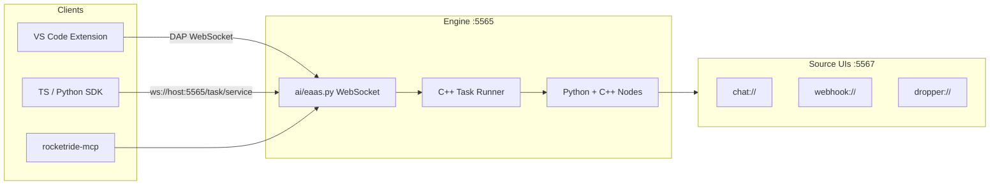

# RocketRide Reference

> **RocketRide** is an open-source **AI Development Environment (AIDE)** — a high-performance pipeline engine for building, debugging, and deploying AI workflows. Pipelines are portable JSON graphs (`.pipe` files), built visually in VS Code, executed by a multithreaded **C++ runtime** with **85+ Python-extensible nodes**.
>
> **Home:** https://rocketride.org · **Docs:** https://docs.rocketride.org · **Repo:** https://github.com/rocketride-org/rocketride-server  
> **Cloned reference:** `reference/rocketride-server/` · **Runtime:** v3.1.0+ · **Monorepo:** v3.3.0

---

## Table of Contents

1. [What RocketRide Is](#what-rocketride-is)
2. [Architecture](#architecture)
3. [Monorepo Layout](#monorepo-layout)
4. [Running the Engine](#running-the-engine)
5. [WebSocket Protocol](#websocket-protocol)
6. [Pipeline System (`.pipe` files)](#pipeline-system-pipe-files)
7. [Data Lanes](#data-lanes)
8. [Control Connections (Agents, LLMs, Tools)](#control-connections-agents-llms-tools)
9. [Node Catalog (85+ Services)](#node-catalog-85-services)
10. [Environment Variables](#environment-variables)
11. [SDKs (TypeScript & Python)](#sdks-typescript--python)
12. [MCP Server](#mcp-server)
13. [VS Code Extension](#vs-code-extension)
14. [Build System](#build-system)
15. [Deployment](#deployment)
16. [Observability & Debugging](#observability--debugging)
17. [Example Pipelines](#example-pipelines)
18. [HackwithBay Integration](#hackwithbay-integration)
19. [Quick Reference Card](#quick-reference-card)

---

## What RocketRide Is

RocketRide turns your IDE into an **AI Development Environment**:

| Capability | Description |
|------------|-------------|
| **Visual pipeline builder** | Drag-and-drop canvas in VS Code — no boilerplate |
| **Portable pipelines** | `.pipe` JSON — version control, share, run anywhere |
| **C++ engine** | Multithreaded runtime for production throughput |
| **85+ nodes** | LLMs, vector DBs, agents, OCR, NER, tools, databases |
| **SDKs** | TypeScript (`rocketride`) and Python (`rocketride`) clients |
| **MCP server** | Expose running pipelines as tools for Cursor/Claude |
| **Observability** | Token usage, latency, traces, memory in the IDE |

**Two ways to run:**
- **Self-host** — Docker, on-prem, local (MIT, no lock-in)
- **RocketRide Cloud** — https://cloud.rocketride.ai/ (managed)

---

## Architecture



| Layer | Technology | Role |
|-------|------------|------|
| **Orchestration** | C++ (`packages/server/engine-lib/`) | Threading, task runner, core services |
| **EAAS layer** | Python (`packages/ai/`) | WebSocket server, pipeline lifecycle |
| **AI / LLM nodes** | Python (`nodes/src/nodes/`) | LLMs, agents, vector DBs, tools |
| **Core data nodes** | C++ (`nodes/src/nodes/core/`) | parse, hash, filesys, indexer |
| **IDE** | TypeScript (`apps/vscode/`) | Canvas, connection manager, debug |
| **Clients** | TS + Python SDKs, MCP | Programmatic access |

**Build output:** `dist/server/` contains `engine` binary, `ai/`, and `nodes/`.

---

## Monorepo Layout

```
rocketride-server/
├── apps/
│   ├── vscode/           # VS Code extension (visual builder)
│   ├── engine/           # C++ main.cpp entry
│   └── *-ui/             # Micro-frontends (chat, dropper, monitor, etc.)
├── packages/
│   ├── server/           # C++ engine (engine-core, engine-lib)
│   ├── ai/               # Python EAAS WebSocket layer
│   ├── client-typescript/# npm: rocketride
│   ├── client-python/    # PyPI: rocketride
│   ├── client-mcp/       # PyPI: rocketride-mcp
│   ├── shared-ui/        # React canvas components
│   └── docs/             # Docusaurus site
├── nodes/                # Python node implementations + services*.json
├── pipelines/            # Curated example .pipe files
├── examples/             # Hackathon-ready templates
├── docker/               # Docker Compose stack
├── deploy/helm/          # Kubernetes Helm chart
├── scripts/              # builder (build.js)
├── docs/agents/          # Agent guides (pipeline rules, quickstart)
└── builder / builder.cmd # Unified build entry
```

---

## Running the Engine

### Prerequisites

| Tool | Version |
|------|---------|
| Node.js | 20+ |
| pnpm | 10+ |
| Python | 3.10+ |
| C++ toolchain | Only if compiling engine from source (default downloads binary) |

### Quick start (from cloned repo)

```bash
cd reference/rocketride-server
pnpm install
./builder build                    # full build → dist/server/
cp .env.template .env              # add API keys as ROCKETRIDE_*
./dist/server/engine ai/eaas.py    # start engine on :5565
```

### Run options

```bash
./dist/server/engine ai/eaas.py
./dist/server/engine ai/eaas.py --host=0.0.0.0 --port=5565
```

Docker:

```bash
docker pull ghcr.io/rocketride-org/rocketride-engine:latest
docker create --name rocketride-engine -p 5565:5565 ghcr.io/rocketride-org/rocketride-engine:latest
```

Or full stack with vector DBs:

```bash
cd docker && cp .env.example .env && docker compose up
```

| Service | Port |
|---------|------|
| Engine | 5565 |
| Postgres (pgvector) | 5432 |
| Milvus | 19530 |
| Chroma | 8000 |

---

## WebSocket Protocol

| Item | Value |
|------|-------|
| **Endpoint** | `ws://<host>:5565/task/service` |
| **HTTP health** | `GET /ping`, `GET /version` |
| **Encoding** | JSON, DAP-style (`type`: `request` / `response` / `event`) |
| **Auth (first frame)** | `{ "auth": "MYAPIKEY", "clientName": "...", "clientVersion": "..." }` |
| **Dev default key** | `MYAPIKEY` |
| **Cloud** | `https://api.rocketride.ai` (WebSocket upgrade) |

### Session flow

1. **Connect** + auth handshake
2. **`use()`** → `rrext_process` / `open` — start pipeline, get task token
3. **`send()` / `pipe()` / `chat()`** → `rrext_process` / `write` — feed data
4. **Events** stream back (`event: "data"`, lane + payload)
5. **`terminate()`** → `rrext_process` / `close`

**Data plane (source UIs):** webhook/chat/dropper bind port **5567** with `/task/data` for browser uploads and chat UI.

Keepalive: pings every 15s, 60s pong timeout, 180s idle timeout.

Full protocol: `packages/server/docs/index.md`

---

## Pipeline System (`.pipe` files)

Pipelines are **JSON graphs** with extension **`.pipe`** (not `.json`).

### Minimal structure

```json
{
  "components": [
    {
      "id": "chat_1",
      "provider": "chat",
      "config": {
        "hideForm": true,
        "mode": "Source",
        "parameters": {},
        "type": "chat"
      },
      "input": []
    },
    {
      "id": "llm_openai_1",
      "provider": "llm_openai",
      "config": {
        "profile": "openai-4o",
        "openai-4o": { "apikey": "${ROCKETRIDE_OPENAI_KEY}" },
        "parameters": {}
      },
      "input": [{ "lane": "questions", "from": "chat_1" }]
    }
  ],
  "source": "chat_1",
  "project_id": "85be2a13-ad93-49ed-a1e1-4b0f763ca618",
  "viewport": { "x": 0, "y": 0, "zoom": 1 },
  "version": 1
}
```

### Rules

| Rule | Detail |
|------|--------|
| **Extension** | Must be `.pipe` |
| **Field order** | `components` first; `project_id`, `viewport`, `version` at bottom |
| **`project_id`** | Literal UUID — **no** `${...}` substitution |
| **`provider`** | Must match a registered service name |
| **`source`** | ID of entry component (webhook, chat, or dropper) |
| **Config** | Supports `${ROCKETRIDE_*}` env var substitution |

Generate UUID: `python -c "import uuid; print(uuid.uuid4())"`

### Source nodes (pipeline entry points)

| Provider | Protocol | UI | Output lanes |
|----------|----------|-----|--------------|
| **`webhook`** | `webhook://` | HTTP POST | `tags`, `text`, `audio`, `video`, `image`, `questions` |
| **`chat`** | `chat://` | Browser chat UI | `questions` |
| **`dropper`** | `dropper://` | Drag-and-drop upload | `tags` |

Source config pattern:

```json
"config": { "hideForm": true, "mode": "Source", "parameters": {}, "type": "chat" }
```

### Response nodes (pipeline outputs)

| Provider | Lane |
|----------|------|
| `response_text` | `text` |
| `response_answers` | `answers` |
| `response_documents` | `documents` |
| `response_table` | `table` |
| `response_image` | `image` |
| `response_audio` | `audio` |
| `response_video` | `video` |
| `response_questions` | `questions` |

---

## Data Lanes

Lanes are **typed data channels** between components:

| Lane | Data Type | Description |
|------|-----------|-------------|
| `tags` | Metadata | File metadata, raw file info |
| `text` | Plain text | Extracted or generated text |
| `table` | Structured | Tables from documents |
| `documents` | Document objects | Chunked docs (often with embeddings) |
| `questions` | Question objects | Questions to answer |
| `answers` | Answer objects | LLM or retrieval answers |
| `image` | Image data | Extracted images |
| `audio` | Audio streams | Audio content |
| `video` | Video streams | Video content |

### Connection syntax

```json
"input": [
  { "lane": "questions", "from": "chat_1" },
  { "lane": "documents", "from": "qdrant_1" }
]
```

### Common transformation chains

```
tags → parse → text → preprocessor_langchain → documents → embedding → qdrant
questions → embedding → qdrant → prompt → llm → response_answers
tags → parse → ocr → ner → anonymize_text → response_text
```

**Rule:** Output lane type must match input lane type.

---

## Control Connections (Agents, LLMs, Tools)

**Critical:** The `control` array goes on the **controlled** node (LLM, tool, memory), NOT on the agent.

```json
// Agent — NO control array, only input lanes
{
  "id": "agent_rocketride_1",
  "provider": "agent_rocketride",
  "config": { "instructions": ["..."], "max_waves": 10, "parameters": {} },
  "input": [{ "lane": "questions", "from": "chat_1" }]
}

// LLM controlled BY agent
{
  "id": "llm_openai_1",
  "provider": "llm_openai",
  "config": { "profile": "openai-4o", "openai-4o": { "apikey": "${ROCKETRIDE_OPENAI_KEY}" } },
  "control": [{ "classType": "llm", "from": "agent_rocketride_1" }]
}

// Tool controlled BY agent
{
  "id": "tool_butterbase_1",
  "provider": "tool_butterbase",
  "config": { "type": "tool_butterbase", "bearer": "${ROCKETRIDE_BUTTERBASE_KEY}" },
  "control": [{ "classType": "tool", "from": "agent_rocketride_1" }]
}

// Memory controlled BY agent (agent_rocketride only)
{
  "id": "memory_internal_1",
  "provider": "memory_internal",
  "config": { "type": "memory_internal" },
  "control": [{ "classType": "memory", "from": "agent_rocketride_1" }]
}
```

### Agent types

| Agent | LLM | Memory | Tools |
|-------|-----|--------|-------|
| `agent_rocketride` | Required (exactly 1) | **Required (exactly 1)** | Optional |
| `agent_crewai` | Required (min 1) | Not supported | Optional |
| `agent_langchain` | Required (min 1) | Not supported | Optional |
| `agent_llamaindex` | Required | Varies | Optional |
| `agent_deepagent` | Required | Optional | Optional |

### Multi-agent (sub-agent as tool)

Sub-agent declares `control: [{ "classType": "tool", "from": "parent_agent_id" }]`. Sub-agent has **no input lanes** — invoked as a tool by parent.

### Tools vs data lanes

Tool nodes (`classType: tool`) have **empty lanes** `{}`. They are invoked at runtime by agents via control plane, not wired with `input`/`output` lanes.

---

## Node Catalog (85+ Services)

Synced to workspace `.rocketride/services-catalog.json` and `.rocketride/schema/<name>.json` by the VS Code extension.

### Sources & I/O

`webhook`, `chat`, `dropper`, `telegram`, `remote`, `text-output`, `local-text-output`

### LLM providers (13+)

`llm_openai`, `llm_anthropic`, `llm_gemini`, `llm_bedrock`, `llm_ollama`, `llm_mistral`, `llm_deepseek`, `llm_perplexity`, `llm_xai`, `llm_qwen`, `llm_kimi`, `llm_minimax`, `llm_nebius`, `llm_gmi_cloud`, `llm_baidu_qianfan`, `llm_openai_api`

### Agents

`agent_rocketride`, `agent_langchain`, `agent_crewai`, `agent_crewai_manager`, `agent_crewai_subagent`, `agent_llamaindex`, `agent_deepagent`, `agent_deepagent_subagent`

### Embeddings

`embedding_openai`, `embedding_transformer`, `embedding_image`, `embedding_video`

### Vector databases (8+)

`qdrant`, `chroma`, `pinecone`, `milvus`, `weaviate`, `elasticsearch`, `opensearch`, `postgres` (pgvector), `astra_db`

### Databases (NL → query)

`db_neo4j`, `db_postgres`, `db_mysql`, `db_supabase`, `db_clickhouse`, `db_arango`, `mongodb+srv`

### Document processing

`parse`, `ocr`, `ner`, `anonymize_text`, `preprocessor_langchain`, `preprocessor_llm`, `preprocessor_code`, `llamaparse`, `reducto`, `landing_ai_parse`, `landing_ai_extract`

### Vision & media

`image_vision_openai`, `image_vision_gemini`, `image_vision_mistral`, `image_vision_ollama`, `background_removal`, `audio_transcribe`, `audio_tts`, `tts_openai`, `tts_elevenlabs`, `video_composer`, `twelvelabs`, `frame_grabber`

### Tools (agent-callable)

`tool_butterbase`, `tool_github`, `tool_git`, `tool_http_request`, `tool_python`, `tool_firecrawl`, `tool_tavily`, `tool_exa_search`, `tool_apify`, `tool_filesystem`, `tool_mem0`, `tool_chartjs`, `tool_daytona`, `tool_deepl`, `tool_bland_ai`, `tool_v0`, `tool_falkordb`, `tool_xtrace_memory`, `tool_pipe`, `mcp_client`

### Memory

`memory_internal`, `memory_persistent`

### Other

`prompt`, `question`, `summarization`, `extract_data`, `guardrails`, `search_exa`, `rerank_cohere`, `hash`, `filesys`, `dictionary`, `anomaly_detector`, `detect`, `detect_segment`, `pose_estimation`, `depth_estimate`, `mcp_client`

---

## Environment Variables

Copy `.env.template` → `.env`:

```env
ROCKETRIDE_URI=http://localhost:5565
ROCKETRIDE_APIKEY=MYAPIKEY

# Passed through to pipeline nodes:
ROCKETRIDE_OPENAI_KEY=sk-...
ROCKETRIDE_ANTHROPIC_KEY=sk-ant-...
ROCKETRIDE_GEMINI_KEY=...
ROCKETRIDE_QDRANT_HOST=localhost
ROCKETRIDE_COLLECTION_NAME=my_collection
NEO4J_URI=neo4j+s://xxx.databases.neo4j.io
NEO4J_PASSWORD=...
```

| Rule | Detail |
|------|--------|
| Prefix | Must be `ROCKETRIDE_*` for pipeline substitution |
| In `.pipe` config | `"apikey": "${ROCKETRIDE_OPENAI_KEY}"` |
| **Not allowed** | `${...}` in `project_id` |
| Extension sync | VS Code auto-syncs `ROCKETRIDE_URI` and `ROCKETRIDE_APIKEY` to `.env` |

---

## SDKs (TypeScript & Python)

### TypeScript (`rocketride` on npm)

```bash
npm install rocketride
```

```typescript
import { RocketRideClient } from 'rocketride';

const client = new RocketRideClient({
  uri: 'ws://localhost:5565',
  auth: process.env.ROCKETRIDE_APIKEY!,
});

await client.connect();
const { token } = await client.use({ filepath: 'examples/rag-pipeline.pipe' });
await client.chat({ token, question: { text: 'What is in the docs?' } });
await client.terminate(token);
await client.disconnect();
```

### Python (`rocketride` on PyPI)

```bash
pip install rocketride
```

```python
import asyncio
from rocketride import RocketRideClient

async def main():
    client = RocketRideClient()  # reads .env
    await client.connect()
    result = await client.use(filepath='examples/rag-pipeline.pipe')
    token = result['token']
    await client.send(token, 'Hello')
    await client.terminate(token)
    await client.disconnect()

asyncio.run(main())
```

### Key client methods

| Method | Purpose |
|--------|---------|
| `connect()` | Auth + WebSocket connect |
| `disconnect()` | Close connection |
| `use({ filepath, pipeline, ... })` | Start/open pipeline → returns `token` |
| `send(token, data, ...)` | Write data to pipeline |
| `pipe(token, ...)` | Streaming upload (`DataPipe`) |
| `chat({ token, question, onSSE })` | Conversational exchange |
| `terminate(token)` | Stop task |
| `getServerInfo(uri)` | Static server metadata |

**Namespaces:** `.account`, `.billing`, `.database`, `.deploy` (cloud features)

**Env vars:** `ROCKETRIDE_URI`, `ROCKETRIDE_APIKEY`

---

## MCP Server

**Package:** `rocketride-mcp` (PyPI)

Exposes **running pipelines** as MCP tools for Cursor, Claude Desktop, etc.

```bash
pip install rocketride-mcp
export ROCKETRIDE_URI=ws://localhost:5565
export ROCKETRIDE_APIKEY=MYAPIKEY
rocketride-mcp
```

```
AI Assistant → MCP → rocketride-mcp → WebSocket → Engine → Your Pipelines
```

Running pipelines are **discovered dynamically** — start a pipeline in VS Code or SDK, it appears as a callable tool.

Docs: `packages/client-mcp/docs/index.md`

---

## VS Code Extension

**Install:** Search "RocketRide" in extension marketplace, or https://open-vsx.org/extension/RocketRide/rocketride

### Features

| Feature | Description |
|---------|-------------|
| **Canvas editor** | Visual builder for `*.pipe` files |
| **Connection Manager** | `local`, `docker`, `service`, `onprem`, `cloud` |
| **Run / debug** | Play/Stop, live traces, token stats |
| **Service catalog** | Syncs `.rocketride/` schemas to workspace |
| **Agent hooks** | Cursor, Claude Code, Copilot, Windsurf |
| **Deploy** | Download engine, Docker, cloud targets |

Build extension: `./builder vscode:build` → `dist/vscode/*.vsix`

### Connection modes

1. **Local (recommended)** — engine runs inside IDE
2. **On-premises** — Docker or self-built from source
3. **RocketRide Cloud** — https://cloud.rocketride.ai/

---

## Build System

```bash
./builder              # → node scripts/build.js
./builder --help       # list all modules/actions
```

### Key commands

| Command | Purpose |
|---------|---------|
| `pnpm install` | Node deps + lefthook |
| `./builder build` | Full build (engine + all modules) |
| `./builder server:build` | Engine only (downloads pre-built binary by default) |
| `./builder server:compile` | Compile C++ from source |
| `./builder nodes:build` | Sync nodes → `dist/server/nodes/` |
| `./builder ai:build` | Sync AI modules |
| `./builder vscode:build` | Build `.vsix` extension |
| `./builder client-typescript:build` | TS SDK |
| `./builder client-python:build` | Python SDK |
| `./builder client-mcp:build` | MCP server |
| `./builder test` | All tests |

### Output layout

| Path | Contents |
|------|----------|
| `dist/server/` | `engine`, `ai/`, `nodes/` |
| `dist/clients/` | SDK wheels/tgz |
| `dist/vscode/` | `.vsix` |
| `build/` | Temp artifacts, vcpkg, CMake cache |

---

## Deployment

### Docker (engine only)

```bash
docker pull ghcr.io/rocketride-org/rocketride-engine:latest
docker run -p 5565:5565 ghcr.io/rocketride-org/rocketride-engine:latest
```

### Docker Compose (full stack)

```bash
cd docker
cp .env.example .env
docker compose up
```

Includes: engine, Postgres/pgvector, Milvus, Chroma, MinIO/etcd.

### Kubernetes (Helm)

```bash
# deploy/helm/rocketride/
# Engine on port 5565; external DBs required
```

### RocketRide Cloud

Managed hosting — same `.pipe` JSON, zero ops: https://cloud.rocketride.ai/

| | Self-host | Cloud |
|---|-----------|-------|
| Endpoint | `ws://localhost:5565` | `https://api.rocketride.ai` |
| API key | `MYAPIKEY` (dev) | From cloud dashboard |

---

## Observability & Debugging

- **VS Code Monitor panel** — select running pipeline for analytics
- **Trace call trees** — token usage, LLM calls, latency, memory
- **Connection Manager** — engine health, deploy status
- **Engine logs** — configurable via `ROCKETRIDE_LOG_LEVEL`

Agent guide: `docs/agents/ROCKETRIDE_OBSERVABILITY.md`

---

## Example Pipelines

### In `examples/` (documented templates)

| File | Pattern |
|------|---------|
| `rag-pipeline.pipe` | Webhook ingest + chat query RAG with Qdrant |
| `llm-benchmark.pipe` | Parallel OpenAI / Anthropic / Gemini agents |
| `document-processor.pipe` | Parse → OCR → NER → anonymize |
| `agent-workflow.pipe` | Multi-agent orchestrator + research sub-agent |
| `agent-llamaindex.pipe` | LlamaIndex ReAct agent |
| `butterbase-agent.pipe` | Agent + Butterbase MCP for backend provisioning |
| `db_arango.pipe` | ArangoDB integration |
| `xtrace-memory-agent.pipe` | xTrace memory tool |
| `landing_ai/*.pipe` | Landing AI parse/extract |

### In `pipelines/` (repo root)

| File | Description |
|------|-------------|
| `git_agent_example.pipe` | Chat → LangChain agent + git tools |
| `exa-search-working.pipe` | Chat → Exa search |
| `text_file_to_audio.pipe` | Dropper → parse → TTS |

### RAG pipeline flow

```
Ingestion:  webhook → parse → preprocessor_langchain → embedding_transformer → qdrant
Query:      chat → embedding_transformer → qdrant → prompt → llm_openai → response_answers
```

---

## HackwithBay Integration

Your workspace already includes RocketRide scaffolding:

| Path | Purpose |
|------|---------|
| `.rocketride/services-catalog.json` | Full node catalog (synced by extension) |
| `.rocketride/schema/*.json` | Per-node config schemas (RJSF forms) |
| `reference/rocketride-server/` | Cloned upstream repo |
| `reference/butterbase-reference.md` | Butterbase backend (pairs with `tool_butterbase`) |
| `reference/neo4j-reference.md` | Neo4j graphs (pairs with `db_neo4j`) |

### Suggested hackathon stack

```
chat (source)
  → agent_rocketride
       ├── llm_openai (control)
       ├── memory_internal (control)
       ├── tool_butterbase (control)  ← Butterbase MCP backend
       └── db_neo4j + llm (control)   ← Graph RAG context
  → response_answers
```

### Key nodes for HackwithBay

| Node | Use |
|------|-----|
| `tool_butterbase` | Provision schema, auth, functions, frontend via Butterbase MCP |
| `db_neo4j` | Natural-language graph Q&A (GraphRAG) |
| `agent_rocketride` | Multi-wave agent with memory + tools |
| `qdrant` / `chroma` | Vector RAG |
| `webhook` / `chat` | Pipeline entry points |

---

## Quick Reference Card

```
Extension:     *.pipe (JSON graph)
Entry:         webhook | chat | dropper
Data wiring:   input: [{ lane, from }]
Agent wiring:  control on LLM/tool/memory → from agent id
Env vars:      ${ROCKETRIDE_*} in config (not project_id)
Engine:        ./dist/server/engine ai/eaas.py
Connect:       ws://localhost:5565/task/service
Auth:          MYAPIKEY (dev)
SDK flow:      connect → use(filepath) → send/chat → terminate
MCP:           pip install rocketride-mcp
Build:         pnpm install && ./builder build
Docker:        docker compose up (in docker/)
Docs:          docs.rocketride.org
```

### Minimal agent pipeline checklist

- [ ] Unique `project_id` (UUID)
- [ ] Source node with `mode: "Source"`
- [ ] Agent with `instructions` and `max_waves`
- [ ] LLM with `control: [{ classType: "llm", from: agent_id }]`
- [ ] `memory_internal` for `agent_rocketride` only
- [ ] Tools with `control: [{ classType: "tool", from: agent_id }]`
- [ ] `response_answers` or `response_text` at end
- [ ] API keys in `.env` as `ROCKETRIDE_*`

---

## Key Links

| Resource | URL |
|----------|-----|
| Home | https://rocketride.org |
| Documentation | https://docs.rocketride.org |
| GitHub | https://github.com/rocketride-org/rocketride-server |
| Python SDK | https://pypi.org/project/rocketride/ |
| TypeScript SDK | https://www.npmjs.com/package/rocketride |
| MCP server | https://pypi.org/project/rocketride-mcp/ |
| VS Code extension | https://open-vsx.org/extension/RocketRide/rocketride |
| RocketRide Cloud | https://cloud.rocketride.ai/ |
| Discord | https://discord.gg/PMXrtenMsY |
| Engine image | `ghcr.io/rocketride-org/rocketride-engine:latest` |

### In-repo agent guides

| File | Topic |
|------|-------|
| `docs/agents/ROCKETRIDE_QUICKSTART.md` | Python/TS working examples |
| `docs/agents/ROCKETRIDE_PIPELINE_RULES.md` | Full pipeline building rules |
| `docs/agents/ROCKETRIDE_COMPONENT_REFERENCE.md` | Component catalog & patterns |
| `packages/server/docs/index.md` | WebSocket protocol |
| `packages/client-mcp/docs/index.md` | MCP server setup |

---

*Compiled for HackwithBay. Pair with `reference/butterbase-reference.md` and `reference/neo4j-reference.md`.*
