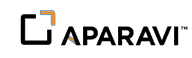
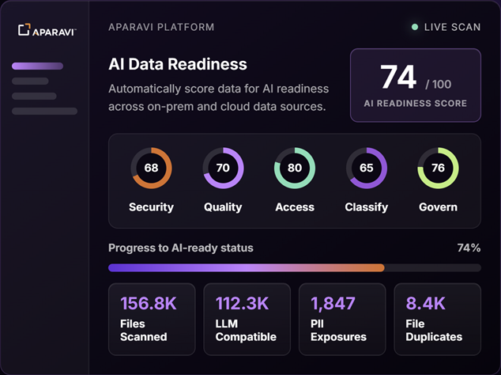
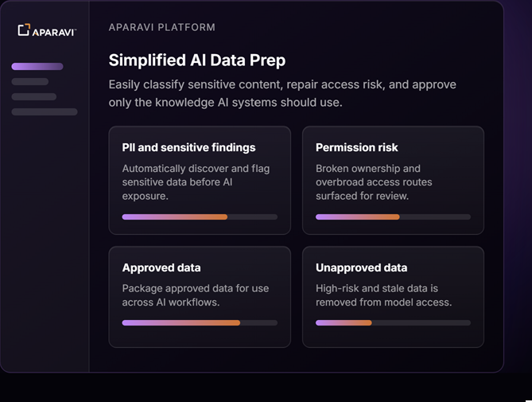
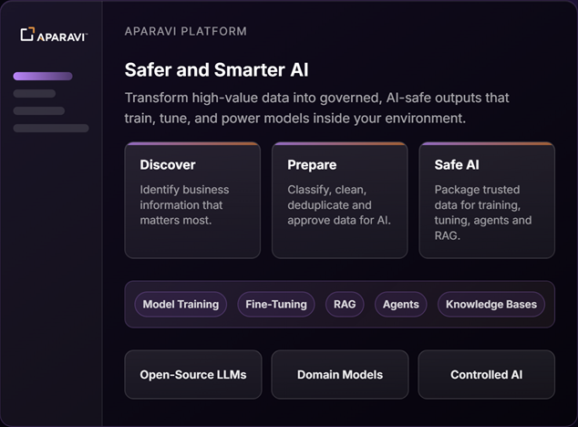

# Aparavi AQL Chat

  

A natural-language chat interface for querying data managed by the
[Aparavi](https://www.aparavi.com) platform. Users ask questions in plain
English and the app translates them into Aparavi Query Language (AQL)
queries, returning results as formatted tables, summaries, and charts.

---

## About Aparavi

Your data, AI ready. Aparavi makes your best data AI-ready, powering
higher-performing models with less risk, lower cost, and full control.

Find the data that matters. Make it safe for AI. Aparavi transforms
enterprise data into governed, AI-ready knowledge bases by simplifying
how organizations discover, classify, and safely package the data that
defines what AI can access, learn from, and act on.

### Core capabilities

  

| Capability | Description |
|---|---|
| **Discover Critical Data** | Find high-value business information across 50+ on-prem and cloud sources (AWS S3, SharePoint, Confluence, databases, and more). AI Readiness scoring highlights what matters most. |
| **Remove Sensitive Risk** | Automatically detect and reduce exposure of PII, PHI, and intellectual property before data reaches any model. |
| **Classify for AI Readiness** | Organize data by type, sensitivity, and readiness using custom categories so only approved content moves forward. |
| **Fix Access Risk** | Identify broken permissions and overshared access routes, then surface them for remediation. |

  

| Capability | Description |
|---|---|
| **Clean Duplicate Content** | Deduplicate redundant data for higher-signal model training and reduced storage cost. |
| **Filter Stale Data** | Remove outdated, low-value content so models learn from current, reliable information. |
| **Package & Deploy** | Package approved data for model training, fine-tuning, RAG, agents, and knowledge bases with leading AI providers. |

  

### Compliance

Aparavi is SOC 2 Type II and ISO 27001 certified with GDPR, CCPA, and
HIPAA compliance support, plus SSO and MFA capabilities. Secure by design.

---

## Configuration

The app requires three settings, configured in the RocketRide settings UI:

| Setting | Description |
|---|---|
| `ROCKETRIDE_APARAVI_URL` | Base URL of the Aparavi platform API (e.g. `https://app.aparavi.com`). |
| `ROCKETRIDE_APARAVI_USER` | User ID for authenticating with the Aparavi API. |
| `ROCKETRIDE_APARAVI_PASSWORD` | Password for authenticating with the Aparavi API (stored as an env key). |

An OpenAI API key (`ROCKETRIDE_OPENAI_KEY`) must also be configured for the
LLM component.

---
